# Docs

## Build Docker Image

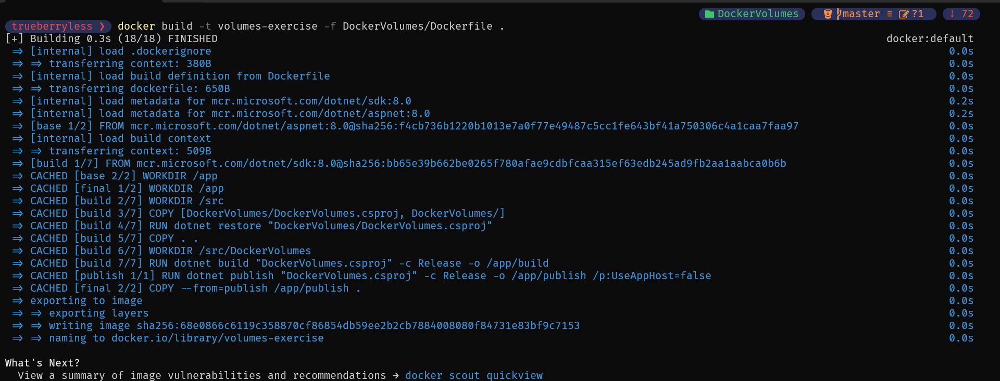

## Start Container

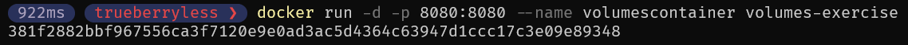

## Add file

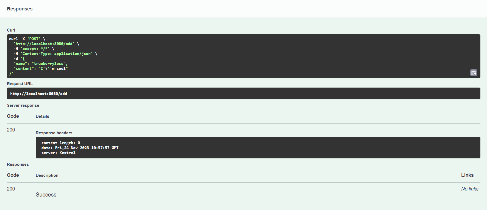

## Get file

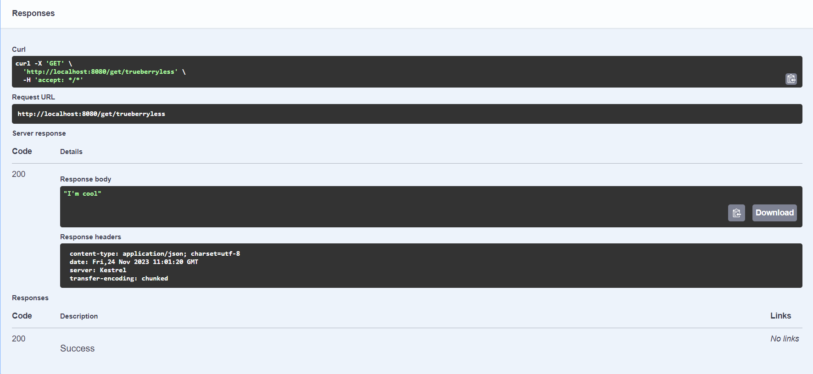

## Find file

We can find our file under /app/persistant.  
Also we can find other files under /app, like dlls, json, config and some others...

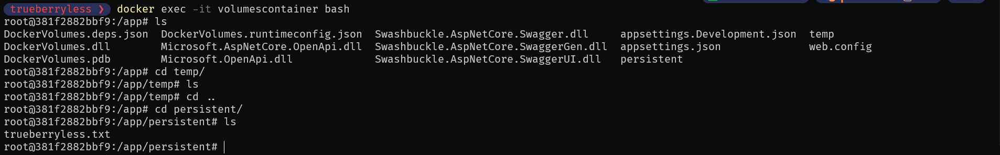

As u can c, there is no files in /app/temp.

## Restart

As u can c, the files are still here (at least the ones that existed before as well).

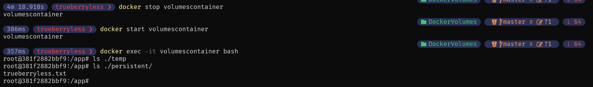

## Remove

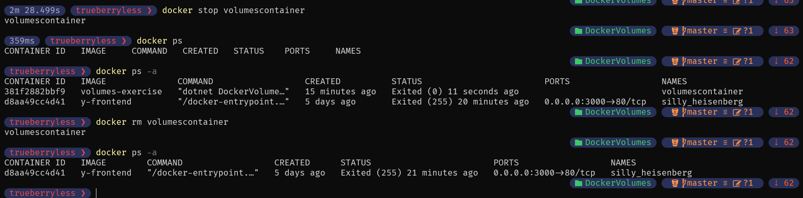

## Start again

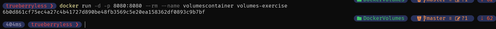

As u can c, the files are not there any more:

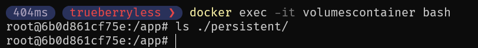

## Do everything again

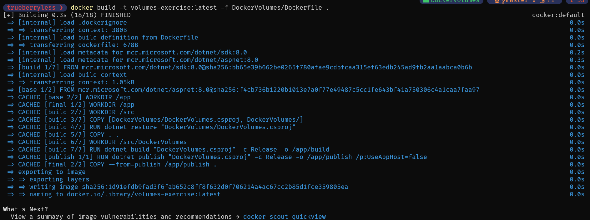

## Inspect

As u can c, there is a volume now, suiii:

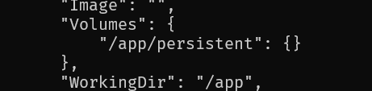

## Docker Desktop Volume

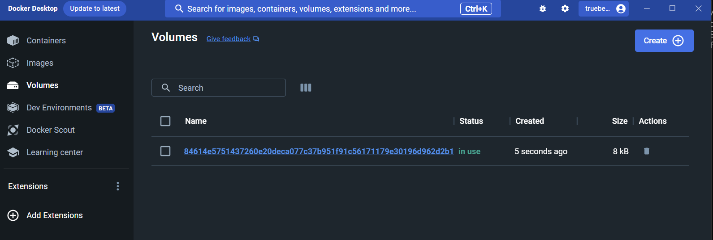

## Stopped

As u can c, there is no volume when container stopped.

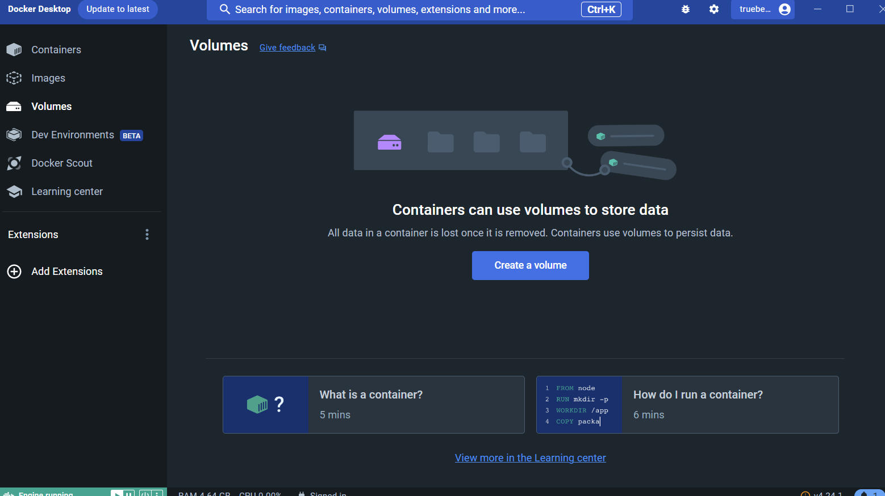

## New container

As u can c, after running again, there is no file.

## Now with -v

If u start with -v, like `docker run -d -p 8081:8080 -v myvolume:/app/persistent --rm --name volumescontainer volumes-exercise`, and create a file, stop, remove and run again, the files will still be there, juhu!

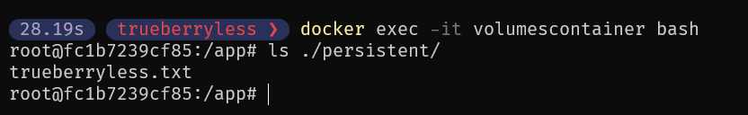
