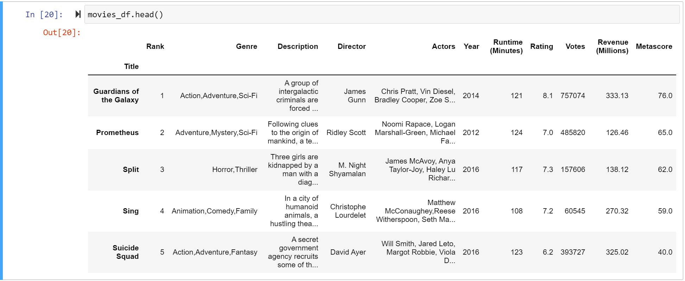
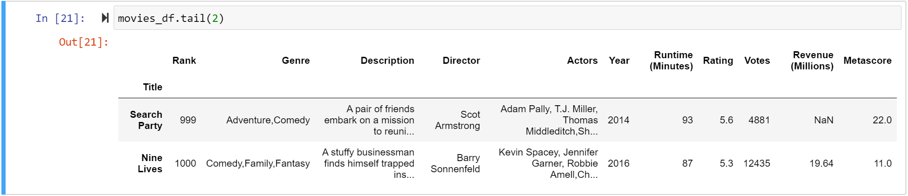
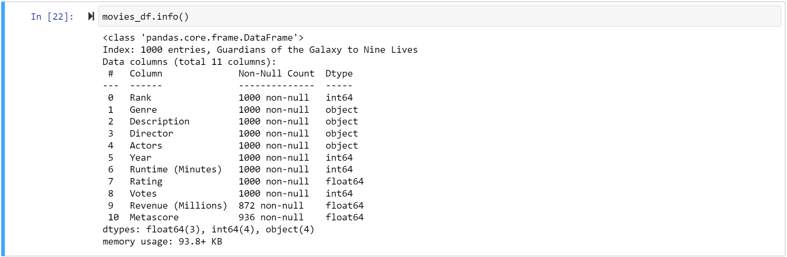
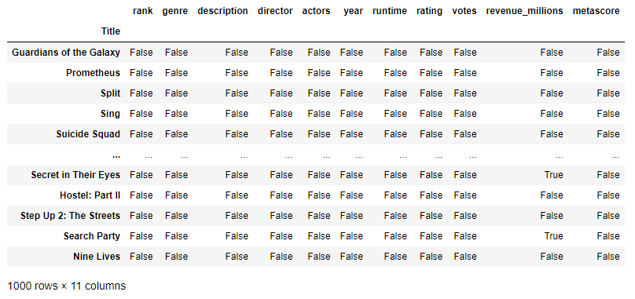
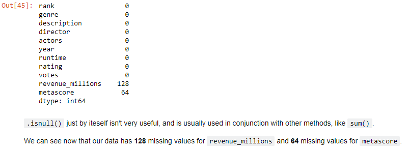
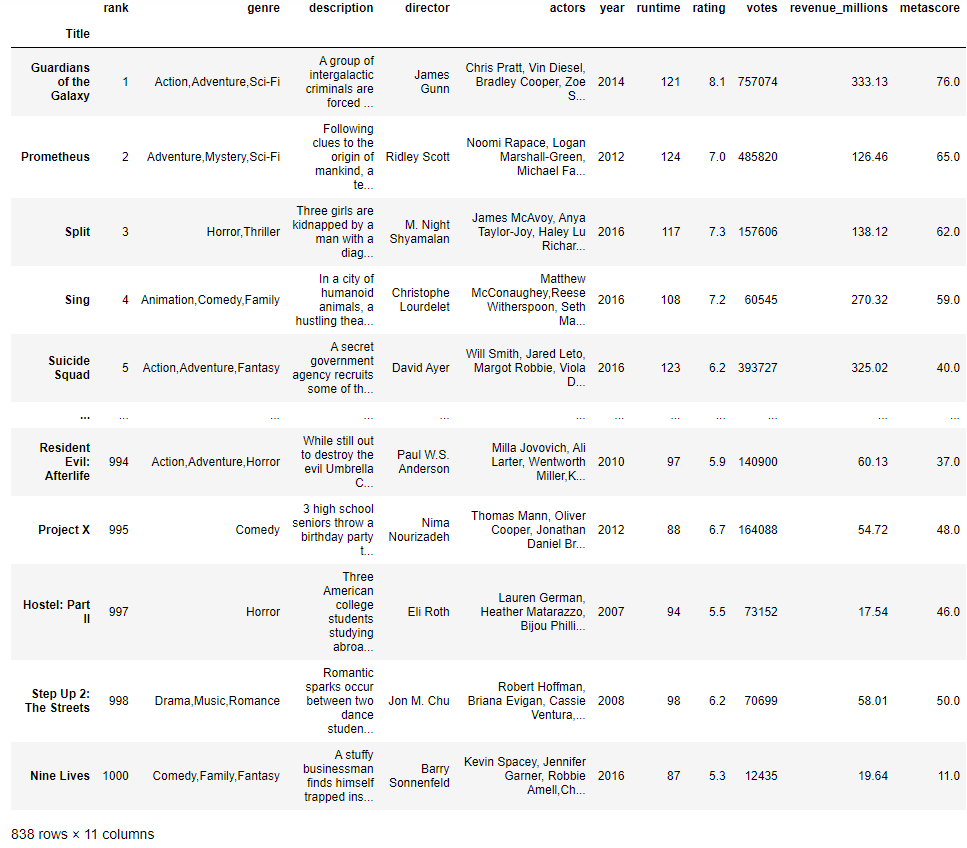
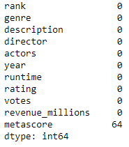
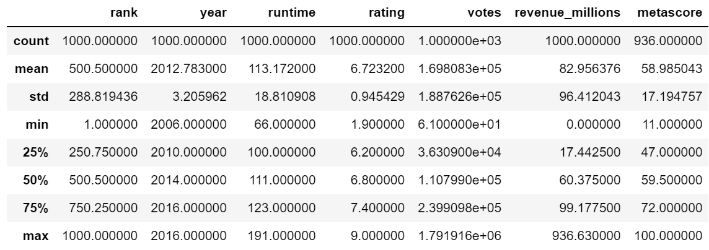

# Pandas

## Installation and Import

The installation and the import are very simple:

```python
pip install pandas
import pandas as pd
```

## Understanding series and dataframes

In Pandas, a Series is a one-dimensional labeled array that can hold any data type, such as integers, floats, strings, or Python objects. A DataFrame, on the other hand, is a two-dimensional labeled data structure with columns that can be of different data types.

Moreover, a series is like a column in an excel file whereas a dataframe represents the whole table.


### Example

Here is an example of a series and a dataframe:

```python
# Create a Pandas Series
s = pd.Series([1, 2, 3, 4, 5], index=['a', 'b', 'c', 'd', 'e'])

# Create a Pandas DataFrame
df = pd.DataFrame([[1, 2, 3], [4, 5, 6], [7, 8, 9]],
              columns=['A', 'B', 'C'],
              index=['x', 'y', 'z'])
```

## Reading

### Reading from CSV

You can read CSV files with pandas and instantly convert it to a dataframe:

```python
df = pd.read_csv('purchases.csv', sep=';', encoding='UTF-8')
```

The separator and the encoding method are optional attributes.
You can use even more attributes. All attributes listet [here](https://pandas.pydata.org/docs/reference/api/pandas.read_csv.html).

### Reading from JSON

Additionally, it is very easy to read data from JSON files, too.

```python
df = pd.read_json('purchases.json', dtype={'col1': str, 'col2': int, 'col3': float})
```

Like above, the not all attributes are necessary. The only attribute which has to be given is the path of th JSON file.
You can read more about reading from JSON files [here](https://pandas.pydata.org/docs/reference/api/pandas.read_json.html).

### Reading from SQL Database

You need to install and import this package:

```python
pip install pysqlite3
import sqlite3
```

You will also need a connection for every interaction with the database:

```python
con = sqlite3.connect("database.db")
```

Then you can use select statements to get specific data:

```python
df = pd.read_sql_query("SELECT * FROM purchases", con)
```

## Converting

### to CSV

```python
df.to_csv('new_purchases.csv')
```

### to JSON

```python
df.to_json('new_purchases.json')
```

### to SQL

```python
df.to_sql('new_purchases.sql', con)
```

## Viewing data

Our Dataframe with Movie-Data:

```python
movies_df = pd.read_csv("IMDB-Movie-Data.csv", index_col="Title")
```

### Head

```python
movies_df.head()
```

This will print out the first few entities from the dataframe like this:



Surely, you can specify how many entities should be printed:

```python
movies_df.head(10)
```

### Tail

If you want to print out the last entities in the list, you can use:

```python
movies_df.tail(2)
```



### Info

Getting info about data:

```python
movies_df.info()
```



As you can see (and calculate with the non-null count), in the worst case szenario only 808 entities can be used properly.<br/>
For explanation: 128 entities could have null values in the column "Revenue" and other 64 entities could have null values in the column "Metascore".

### Shape

You can get the shape of a dataframe:

```python
movies_df.shape
```

## Duplicates

```python
temp_df.drop_duplicates()
```

You can either keep the first or last entry or drop both:

```python
temp_df.drop_duplicates(keep='first')
temp_df.drop_duplicates(keep='last')
temp_df.drop_duplicates(keep=False)
```

## Cleanup

Print columns:

```python
movies_df.columns
```

Renaming:

```python
movies_df.rename(columns={
    'Runtime (Minutes)': 'Runtime',
    'Revenue (Millions)': 'Revenue_millions'
}, inplace=True)
```

```python
movies_df.columns = ['rank', 'genre', 'description', 'director', 'actors', 'year', 'runtime',
                 'rating', 'votes', 'revenue_millions', 'metascore']
```

```python
movies_df.columns = [col.lower() for col in movies_df]
```

## Modifying in place

When calling a method, using the inplace keyword argument with value True will automatically change the object without having to save manually.

These two lines have the same result:

```python
temp_df = temp_df.drop_duplicates()
temp_df.drop_duplicates(inplace=True)
```

## Missing Values

```python
movies_df.isnull()
```



Now we can calculate the number of null-values:

```python
movies_df.isnull().sum()
```

This gives us the same information which we calculated earlier: only 808 entries can be used in the worst case scenario [[Info](#info)]



### Removing all null-values

#### Row

To remove all rows with null-values from the dataframe and save it into another dataframe, use .dropna():

```python
movies_without_null_values_df = movies_df.dropna()
```

and as you can see, there are only 838 entities left (from 1000 entities).



However, the old dataframe is untouched.

#### Column

You can also remove the column:

```python
movies_without_null_values_df = movies_df.dropna(axis=1)
```

So there are only 9 columns left (out of 11):


## Imputation

A technique where you replace nulls with non-null values.

This code will replace all null-values in the column revenue_millions with the mean value of all other revenue_millions values:

```python
revenue = movies_df['revenue_millions']
revenue.fillna(revenue.mean(), inplace=True)
movies_df.isnull().sum()
```



Notice that by using `inplace=True` we have actually affected the original `movies_df`!

## Understanding variables

```python
movies_df.describe()
```


