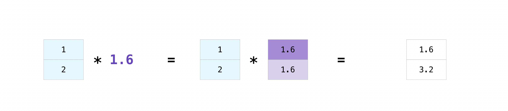

# NumPy fundamentals

Many thanks to: https://numpy.org/doc/stable/user/absolute_beginners.html

## Introduction

There are 6 general mechanisms for creating arrays:

1. Conversion from other Python structures (i.e. lists and tuples) 

2. Intrinsic NumPy array creation functions (e.g. arange, ones, zeros, etc.)

3. Replicating, joining, or mutating existing arrays

4. Reading arrays from disk, either from standard or custom formats

5. Creating arrays from raw bytes through the use of strings or buffers

6. Use of special library functions (e.g. random)

In most case, we do it as described in 1 or 2.


```python
# Import numpy
import numpy as np
```


```python
!pip list
```

    Package                       Version
    ----------------------------- --------------------
    alabaster                     0.7.12
    anaconda-client               1.11.0
    anaconda-navigator            2.3.1
    anaconda-project              0.11.1
    anyio                         3.5.0
    appdirs                       1.4.4
    argon2-cffi                   21.3.0
    argon2-cffi-bindings          21.2.0
    arrow                         1.2.2
    astroid                       2.11.7
    astropy                       5.1
    atomicwrites                  1.4.0
    attrs                         21.4.0
    Automat                       20.2.0
    autopep8                      1.6.0
    Babel                         2.9.1
    backcall                      0.2.0
    backports.functools-lru-cache 1.6.4
    backports.tempfile            1.0
    backports.weakref             1.0.post1
    bcrypt                        3.2.0
    beautifulsoup4                4.11.1
    binaryornot                   0.4.4
    bitarray                      2.5.1
    bkcharts                      0.2
    black                         22.6.0
    bleach                        4.1.0
    bokeh                         2.4.3
    boto3                         1.24.28
    botocore                      1.27.28
    Bottleneck                    1.3.5
    brotlipy                      0.7.0
    certifi                       2022.9.14
    cffi                          1.15.1
    chardet                       4.0.0
    charset-normalizer            2.0.4
    click                         8.0.4
    cloudpickle                   2.0.0
    clyent                        1.2.2
    colorama                      0.4.5
    colorcet                      3.0.0
    comtypes                      1.1.10
    conda                         22.9.0
    conda-build                   3.22.0
    conda-content-trust           0.1.3
    conda-pack                    0.6.0
    conda-package-handling        1.9.0
    conda-repo-cli                1.0.20
    conda-token                   0.4.0
    conda-verify                  3.4.2
    constantly                    15.1.0
    cookiecutter                  1.7.3
    cryptography                  37.0.1
    cssselect                     1.1.0
    cycler                        0.11.0
    Cython                        0.29.32
    cytoolz                       0.11.0
    daal4py                       2021.6.0
    dask                          2022.7.0
    datashader                    0.14.1
    datashape                     0.5.4
    debugpy                       1.5.1
    decorator                     5.1.1
    defusedxml                    0.7.1
    diff-match-patch              20200713
    dill                          0.3.4
    distributed                   2022.7.0
    docutils                      0.18.1
    entrypoints                   0.4
    et-xmlfile                    1.1.0
    fastjsonschema                2.16.2
    filelock                      3.6.0
    flake8                        4.0.1
    Flask                         1.1.2
    fonttools                     4.25.0
    fsspec                        2022.7.1
    future                        0.18.2
    gensim                        4.1.2
    glob2                         0.7
    greenlet                      1.1.1
    h5py                          3.7.0
    HeapDict                      1.0.1
    holoviews                     1.15.0
    hvplot                        0.8.0
    hyperlink                     21.0.0
    idna                          3.3
    imagecodecs                   2021.8.26
    imageio                       2.19.3
    imagesize                     1.4.1
    importlib-metadata            4.11.3
    incremental                   21.3.0
    inflection                    0.5.1
    iniconfig                     1.1.1
    intake                        0.6.5
    intervaltree                  3.1.0
    ipykernel                     6.15.2
    ipython                       7.31.1
    ipython-genutils              0.2.0
    ipywidgets                    7.6.5
    isort                         5.9.3
    itemadapter                   0.3.0
    itemloaders                   1.0.4
    itsdangerous                  2.0.1
    jdcal                         1.4.1
    jedi                          0.18.1
    jellyfish                     0.9.0
    Jinja2                        2.11.3
    jinja2-time                   0.2.0
    jmespath                      0.10.0
    joblib                        1.1.0
    json5                         0.9.6
    jsonschema                    4.16.0
    jupyter                       1.0.0
    jupyter_client                7.3.4
    jupyter-console               6.4.3
    jupyter_core                  4.11.1
    jupyter-server                1.18.1
    jupyterlab                    3.4.4
    jupyterlab-pygments           0.1.2
    jupyterlab-server             2.10.3
    jupyterlab-widgets            1.0.0
    keyring                       23.4.0
    kiwisolver                    1.4.2
    lazy-object-proxy             1.6.0
    libarchive-c                  2.9
    llvmlite                      0.38.0
    locket                        1.0.0
    lxml                          4.9.1
    lz4                           3.1.3
    Markdown                      3.3.4
    MarkupSafe                    2.0.1
    matplotlib                    3.5.2
    matplotlib-inline             0.1.6
    mccabe                        0.6.1
    menuinst                      1.4.19
    mistune                       0.8.4
    mkl-fft                       1.3.1
    mkl-random                    1.2.2
    mkl-service                   2.4.0
    mock                          4.0.3
    mpmath                        1.2.1
    msgpack                       1.0.3
    multipledispatch              0.6.0
    munkres                       1.1.4
    mypy-extensions               0.4.3
    navigator-updater             0.3.0
    nbclassic                     0.3.5
    nbclient                      0.5.13
    nbconvert                     6.4.4
    nbformat                      5.5.0
    nest-asyncio                  1.5.5
    networkx                      2.8.4
    nltk                          3.7
    nose                          1.3.7
    notebook                      6.4.12
    numba                         0.55.1
    numexpr                       2.8.3
    numpy                         1.21.5
    numpydoc                      1.4.0
    olefile                       0.46
    openpyxl                      3.0.10
    packaging                     21.3
    pandas                        1.4.4
    pandocfilters                 1.5.0
    panel                         0.13.1
    param                         1.12.0
    paramiko                      2.8.1
    parsel                        1.6.0
    parso                         0.8.3
    partd                         1.2.0
    pathlib                       1.0.1
    pathspec                      0.9.0
    patsy                         0.5.2
    pep8                          1.7.1
    pexpect                       4.8.0
    pickleshare                   0.7.5
    Pillow                        9.2.0
    pip                           22.2.2
    pkginfo                       1.8.2
    platformdirs                  2.5.2
    plotly                        5.9.0
    pluggy                        1.0.0
    poyo                          0.5.0
    prometheus-client             0.14.1
    prompt-toolkit                3.0.20
    Protego                       0.1.16
    psutil                        5.9.0
    ptyprocess                    0.7.0
    py                            1.11.0
    pyasn1                        0.4.8
    pyasn1-modules                0.2.8
    pycodestyle                   2.8.0
    pycosat                       0.6.3
    pycparser                     2.21
    pyct                          0.4.8
    pycurl                        7.45.1
    PyDispatcher                  2.0.5
    pydocstyle                    6.1.1
    pyerfa                        2.0.0
    pyflakes                      2.4.0
    Pygments                      2.11.2
    PyHamcrest                    2.0.2
    PyJWT                         2.4.0
    pylint                        2.14.5
    pyls-spyder                   0.4.0
    PyNaCl                        1.5.0
    pyodbc                        4.0.34
    pyOpenSSL                     22.0.0
    pyparsing                     3.0.9
    pyrsistent                    0.18.0
    PySocks                       1.7.1
    pytest                        7.1.2
    python-dateutil               2.8.2
    python-lsp-black              1.0.0
    python-lsp-jsonrpc            1.0.0
    python-lsp-server             1.3.3
    python-slugify                5.0.2
    python-snappy                 0.6.0
    pytz                          2022.1
    pyviz-comms                   2.0.2
    PyWavelets                    1.3.0
    pywin32                       302
    pywin32-ctypes                0.2.0
    pywinpty                      2.0.2
    PyYAML                        6.0
    pyzmq                         23.2.0
    QDarkStyle                    3.0.2
    qstylizer                     0.1.10
    QtAwesome                     1.0.3
    qtconsole                     5.2.2
    QtPy                          2.2.0
    queuelib                      1.5.0
    regex                         2022.7.9
    requests                      2.28.1
    requests-file                 1.5.1
    rope                          0.22.0
    Rtree                         0.9.7
    ruamel-yaml-conda             0.15.100
    s3transfer                    0.6.0
    scikit-image                  0.19.2
    scikit-learn                  1.0.2
    scikit-learn-intelex          2021.20221004.171935
    scipy                         1.9.1
    Scrapy                        2.6.2
    seaborn                       0.11.2
    Send2Trash                    1.8.0
    service-identity              18.1.0
    setuptools                    63.4.1
    sip                           4.19.13
    six                           1.16.0
    smart-open                    5.2.1
    sniffio                       1.2.0
    snowballstemmer               2.2.0
    sortedcollections             2.1.0
    sortedcontainers              2.4.0
    soupsieve                     2.3.1
    Sphinx                        5.0.2
    sphinxcontrib-applehelp       1.0.2
    sphinxcontrib-devhelp         1.0.2
    sphinxcontrib-htmlhelp        2.0.0
    sphinxcontrib-jsmath          1.0.1
    sphinxcontrib-qthelp          1.0.3
    sphinxcontrib-serializinghtml 1.1.5
    spyder                        5.2.2
    spyder-kernels                2.2.1
    SQLAlchemy                    1.4.39
    statsmodels                   0.13.2
    sympy                         1.10.1
    tables                        3.6.1
    tabulate                      0.8.10
    TBB                           0.2
    tblib                         1.7.0
    tenacity                      8.0.1
    terminado                     0.13.1
    testpath                      0.6.0
    text-unidecode                1.3
    textdistance                  4.2.1
    threadpoolctl                 2.2.0
    three-merge                   0.1.1
    tifffile                      2021.7.2
    tinycss                       0.4
    tldextract                    3.2.0
    toml                          0.10.2
    tomli                         2.0.1
    tomlkit                       0.11.1
    toolz                         0.11.2
    tornado                       6.1
    tqdm                          4.64.1
    traitlets                     5.1.1
    Twisted                       22.2.0
    twisted-iocpsupport           1.0.2
    typing_extensions             4.3.0
    ujson                         5.4.0
    Unidecode                     1.2.0
    urllib3                       1.26.11
    w3lib                         1.21.0
    watchdog                      2.1.6
    wcwidth                       0.2.5
    webencodings                  0.5.1
    websocket-client              0.58.0
    Werkzeug                      2.0.3
    wheel                         0.37.1
    widgetsnbextension            3.5.2
    win-inet-pton                 1.1.0
    win-unicode-console           0.5
    wincertstore                  0.2
    wrapt                         1.14.1
    xarray                        0.20.1
    xlrd                          2.0.1
    XlsxWriter                    3.0.3
    xlwings                       0.27.15
    yapf                          0.31.0
    zict                          2.1.0
    zipp                          3.8.0
    zope.interface                5.4.0
    

## How to create a basic array (=Vector)
To create a NumPy array, you can use the function `np.array()`. All you need to do to create a simple array is pass a list to it.


```python
array = np.array([1, 2, 3])
print(type(array))
print(array)
```

    <class 'numpy.ndarray'>
    [1 2 3]
    

You can visualize your array this way:


### How do we get the dimension, size or shape of an array?
- `ndarray.ndim` will tell you the number of axes, or dimensions, of the array.

- `ndarray.size` will tell you the total number of elements of the array. This is the product of the elements of the array’s shape.

- `ndarray.shape` will display a tuple of integers that indicate the number of elements stored along each dimension of the array. If, for example, you have a 2-D array with 2 rows and 3 columns, the shape of your array is (2, 3).
- `ndarray.dtype` will tell you the data type. The Elements are all of the same type.


```python
array.ndim
```


    1


```python
array.size
```


    3


```python
print(type(array.shape))
print(array.shape)
```

    <class 'tuple'>
    (3,)
    


```python
array.dtype
```


    dtype('int32')


### Intrinsic NumPy array creation functions
- `np.zeros()` creates an array filled with 0’s
- `np.ones()` creates an array filled with 1’s
- `np.arange()` creates an array with a range of elements
- `np.linspace()` creates an array with values that are spaced linearly in a specified interval 


```python
# Return a new array of given shape and type
print(np.zeros(2))
print()

# with tuples
print(np.zeros((2)))
print()
print(np.zeros((2, 2)))
```

    [0. 0.]
    
    [0. 0.]
    
    [[0. 0.]
     [0. 0.]]
    


```python
# Return a new array of given shape and type
print(np.ones(2))
print()

# with tuples
print(np.ones((2)))
print()
print(np.ones((2, 2)))
```

    [1. 1.]
    
    [1. 1.]
    
    [[1. 1.]
     [1. 1.]]
    


```python
# arange([start,] stop[, step,], dtype=None, *, like=None)
print(np.arange(10))
print(np.arange(3, 10))
print(np.arange(1, 10, 2))
```

    [0 1 2 3 4 5 6 7 8 9]
    [3 4 5 6 7 8 9]
    [1 3 5 7 9]
    


```python
#np.linspace(start,stop,num=50,endpoint=True,retstep=False,dtype=None,axis=0)
print(np.linspace(1, 10))
print(np.linspace(1, 10, 5))
print(np.linspace(1, 10, 3))
```

    [ 1.          1.18367347  1.36734694  1.55102041  1.73469388  1.91836735
      2.10204082  2.28571429  2.46938776  2.65306122  2.83673469  3.02040816
      3.20408163  3.3877551   3.57142857  3.75510204  3.93877551  4.12244898
      4.30612245  4.48979592  4.67346939  4.85714286  5.04081633  5.2244898
      5.40816327  5.59183673  5.7755102   5.95918367  6.14285714  6.32653061
      6.51020408  6.69387755  6.87755102  7.06122449  7.24489796  7.42857143
      7.6122449   7.79591837  7.97959184  8.16326531  8.34693878  8.53061224
      8.71428571  8.89795918  9.08163265  9.26530612  9.44897959  9.63265306
      9.81632653 10.        ]
    [ 1.    3.25  5.5   7.75 10.  ]
    [ 1.   5.5 10. ]
    


```python
print(np.linspace(1, 10).shape) # default num is 50 by default
```

    (50,)
    

### Specifying your data type
While the default data type is floating point (`np.float64`), you can explicitly specify which data type you want using the `dtype` keyword.


```python
dtype_example = np.arange(1, 10, 2, 'int8')
dtype_example = np.arange(1, 10, 2, dtype=np.int8)
```


```python
print(dtype_example)
print(dtype_example.dtype)
```

    [1 3 5 7 9]
    int8
    

### What about reshaping an array?
Yes, this is possible, but a little tricky! 

>Using `arr.reshape()` will give a new shape to an array without changing the data. Just remember that when you use the reshape method, the array you want to produce needs to have the **same number of elements** as the original array. If you start with an array with 12 elements, you’ll need to make sure that your new array also has a total of 12 elements.


```python
reshape_example = np.arange(1, 7)
print(reshape_example)
```

    [1 2 3 4 5 6]
    

To reshape this vector in an array with three rows and two columns, use `reshape(3,2)`.


```python
reshape_example = reshape_example.reshape((2, 3))
print(reshape_example)
```

    [[1 2 3]
     [4 5 6]]
    


```python
reshape_example = reshape_example.reshape((3, 2))
print(reshape_example)
```

    [[1 2]
     [3 4]
     [5 6]]
    


Eureka! We converted a vector into a 2D array (Matrix). To convert the array back to a vector, use `reshape` again


```python
reshape_example = reshape_example.reshape((6,))
print(reshape_example)
```

    [1 2 3 4 5 6]
    


```python
# fast and easy method to convert back to vector
reshape_example = reshape_example.reshape(-1)
print(reshape_example)
```

    [1 2 3 4 5 6]
    

### Indexing and slicing
You can index and slice NumPy arrays in the same ways you can slice Python lists.


```python
data = np.array([1, 2, 3])
```


```python
# looks more complicated that it is (it just prints every possibility)

for i in range(-len(data), len(data) + 1):
    other_i = True
    for j in range(-len(data), len(data) + 1):
        if i < 0 and other_i:
            print(f"data[{i}:]: {data[i:]}")
            other_i = False
        if i < j:
            if i < 0 and j >= 0: continue
            print(f"data[{i}:{j}]: {data[i:j]}")  
```

    data[-3:]: [1 2 3]
    data[-3:-2]: [1]
    data[-3:-1]: [1 2]
    data[-2:]: [2 3]
    data[-2:-1]: [2]
    data[-1:]: [3]
    data[0:1]: [1]
    data[0:2]: [1 2]
    data[0:3]: [1 2 3]
    data[1:2]: [2]
    data[1:3]: [2 3]
    data[2:3]: [3]
    


## Basic array operations
### Broadcasting
There are times when you might want to carry out an operation between an array and a single number (also called an operation between a vector and a scalar). For example, your array (we’ll call it “data”) might contain information about distance in miles but you want to convert the information to kilometers. You can perform this operation with:


```python
data = np.array([1.0, 2.0])

data * 1.6
```


    array([1.6, 3.2])




### Addition, subtraction, multiplication, division, and more


```python
data = np.array([1, 2])
ones = np.ones(2, dtype=int)
```


```python
data + ones
```


    array([2, 3])


```python
data - ones
```


    array([0, 1])


```python
data * ones
```


    array([1, 2])


```python
data / data
```


    array([1., 1.])


### More useful array operations


```python
data = np.array([1, 2, 3])
```


```python
data.max()
```


    3


```python
data.min()
```


    1


```python
data.sum()
```


    6


```python
# doesn't work unfortunately
# data.average()
```


## Creating 2D arrays (matrices)
You can pass Python lists of lists to create a 2-D array (or “matrix”) to represent them in NumPy.


```python
data = np.arange(1, 7).reshape(3, 2)
print(data)
```

    [[1 2]
     [3 4]
     [5 6]]
    


### Indexing and slicing operations 


```python
# filter a value with their indices
print(data[0,1])
```

    2
    


```python
print(data[1:3])
print(data[1:3,:]) # little bit more difficult
```

    [[3 4]
     [5 6]]
    [[3 4]
     [5 6]]
    


```python
print(data[0:2,0])
print(data[1:,1])
```

    [1 3]
    [4 6]
    


### Useful operations with matrices 


```python
data.max()
```


    6


```python
data.min()
```


    1


```python
data.sum()
```


    21


You can aggregate all the values in a matrix and you can aggregate them across **columns** or **rows** using the `axis` parameter:


```python
data = np.array([[1, 2],[5, 3],[4, 6]])
```


```python
data.max(axis=0)
```


    array([5, 6])


```python
data.max(axis=1)
```


    array([2, 5, 6])


Once you’ve created your matrices, you can add and multiply them using arithmetic operators if you have **two matrices** that are the **same size**.


```python
data = np.array([[1, 2], [3, 4]])
ones = np.array([[1, 1], [1, 1]])
```


```python
data + ones
```


    array([[2, 3],
           [4, 5]])


You can do these arithmetic operations on matrices of different sizes, but only if one matrix has only one column or one row. In this case, NumPy will use its **broadcast rules** for the operation.


```python
data = np.array([[1, 2], [3, 4], [5, 6]])
ones_row = np.array([[1, 1]])
```


```python
data + ones_row
```


    array([[2, 3],
           [4, 5],
           [6, 7]])


### Transposing a matrix


```python
# turn around

print(data)
print("\n")
print(data.T)
```

    [[1 2]
     [3 4]
     [5 6]]
    
    
    [[1 3 5]
     [2 4 6]]
    

### Flattening multidemsional arrays


```python
# variant 1
print(data.reshape(-1))

# variant 2
print(data.flatten())
```

    [1 2 3 4 5 6]
    [1 2 3 4 5 6]
    

### Dot product of two arrays


```python
a = np.array([1, 2, 3])
b = np.array([4, 5, 6])

# skalar product: a ⋅ b = ax * bx + ay * by + az * bz
```


```python
np.dot(a,b)
```


    32


```python
a.dot(b)
```


    32


