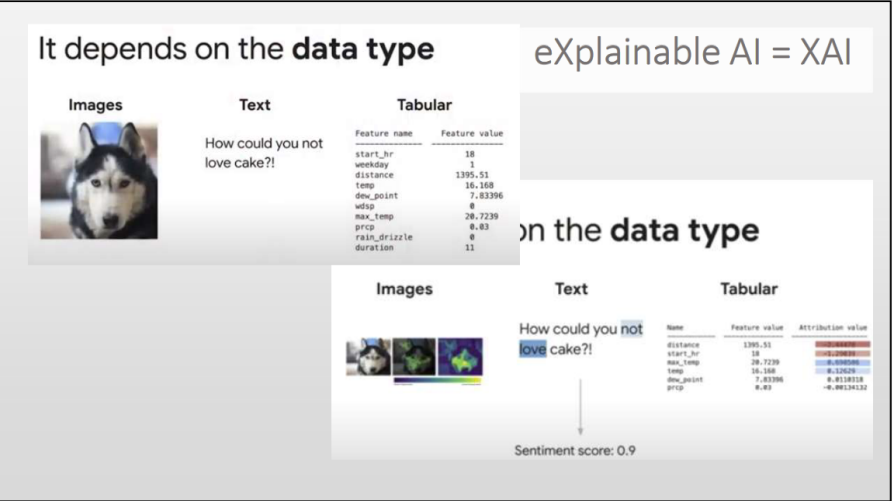
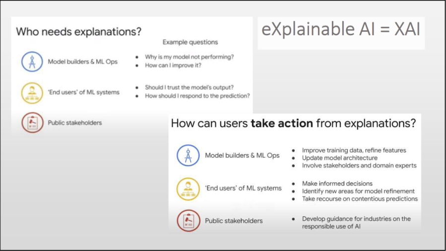

## EU Gesetz - vier Stufen von KI

Das EU Gesetz definiert im Dezember 2023 vier verschiedene Stufen von KI, welche sich in der Schwerwiegigkeit der KI-Anwendungen unterscheiden.

### Unacceptable Risk

Jegliche KIen, welche verschiedenste Bedrohungen (Menschenrechte, Sicherheiten, Lebensunterhalt, ...) mit sich bringen, sind verboten.

Ein **Beispiel**: Anwendung 3: Ein automatisiertes Entscheidungsunterstützungssystem für die Vergabe von staatlichen Sozialleistungen. Diese KI-Anwendung analysiert die finanzielle Situation und andere relevante Informationen von Antragstellern, um automatisierte Entscheidungen über die Berechtigung und Höhe von Sozialleistungen zu treffen.

### High Risk

KI-Systeme, welche in einigen kritischen Bereichen, wie zum Beispiel Verkehr, Bildung, Management, Kreditwürdigkeit, Migration, demokratische Prozesse, ..., angewandt werden können, werden äußerst strengen Anforderungen gestellt und stark kontrolliert.

Ein **Beispiel**: Anwendung 2: Ein Spracherkennungssystem zur automatisierten Analyse von Notrufen bei einer Rettungsleitstelle. Diese KI-Anwendung analysiert automatisch eingehende Notrufe, um die Dringlichkeit und Art des Notfalls zu erkennen und entsprechende Maßnahmen einzuleiten.

### Limited Risk

All jene Systeme, welche eine gewisse Transparenz voraussetzen. Sprich: Der Nutzer muss wissen, dass es sich um eine KI handelt (Chatbots, ...).

### Minimal Risk

Bei KI-Systemen ohne bzw. mit wenig Risiko, ist die freie Nutzung erlaubt.

Ein **Beispiel**: Anwendung 1: Ein personalisiertes Empfehlungssystem für einen Streaming-Service wie Netflix oder Spotify. Diese KI-Anwendung analysiert das Nutzerverhalten, um Empfehlungen für Filme, Serien oder Musiktitel zu geben.

## Responsible AI

### Fairness

Man muss sicherstellen, dass das KI-Modell keine Vorurteile verstärken, sonder eher objektiv an das Thema herangehen. Zusätzlich müssen alle Arten von Nutzern gleich und fair behandelt werden. Das Modell darf kein Vorurteil anhand der Person, die den Prompt gibt, tätigen.

### Explainability

**Transparenz**

Die Erklärbarkeit definiert sich mit der Herleitbarkeit, warum das KI-System zu einem bestimmten Ergebnis geführt hat.

Wie man in diesem Bild beispielsweise sehen kann, ist pro Datentype eine unterschiedliche Form der Erklärbarkeit notwendig. In Bildern führen gewissen Pixel zu bestimmten Entscheidungen der KI. Bei Text sind einige Wörter ausschlaggebend. Allgemein gibt es verschiedene Parameter, welche jeweils mit einem bestimmten Gewicht + den Bias zu einer Vorhersage bzw einem Ergebnis führen.

Diese Informationen der Erklärbarkeit helfen nicht nur dem Entwickler der KI, da es leichter ist, das System zu verbessern, wenn man weiß, was zu einer (womöglich) falschen Entscheidung der KI geführt hat. Denn auch der Endnutzer profitiert von der Information, wie das System zu dem Entschluss gekommen ist. Diese Art der Quellenangabe kann dem Nutzer helfen, zu beurteilen, ob man dem Ergebnis vertrauen kann oder nicht. Alle involvierten Personen (Stakeholders) können aufgrund der Erklärbarkeit besser beurteilen, ob die KI die Regulierungen einhält.

Demnach können Entwickler das System verbessern und aktualisieren, Nutzer sinnvolle Entscheidungen treffen und Stakeholders Regulierungen und Protokollerklärungen besser definieren, da das System dahinter klar und deutlich wird.

### Privacy

Der Datenschutz jeder Person muss sichergestellt werden. Es dürfen keine privaten Daten an Dritte gelangen, wenn dies nicht explizit gewünscht ist. Diese Privatsphäre ist ein Grundbedürfnis jedes Menschen.

### Robustness

Das KI-System darf nicht von Menschen missbraucht werden, indem bestimmte Prompts zu gewissen Informationen führen, welche schädlich für andere Menschen oder die Menschheit im Allgemeinen sein könnten. Die goldene Mitte der Robustheit zu finden, ist eine besonders schwierige Aufgabe für die Entwickler der KI.

## Model Cards

Model Cards sind Definitionen über das trainierte KI-Modell, welches vergleichbar mit der Nahrunsmitteltabelle eines Müslis ist. Die Model Card definiert, was das KI-Modell ist, wie es trainiert wurde, welcher Typ von Classifier es ist (falls es ein Classifier ist), usw. Doch auch eine Sprachübersetzungssoftware kann eine Model Card verwenden, welche zum Beispiel Dialekte, Sprichwörter einer Sprache oder sonstiges definiert und dem Nutzer deutlich macht, was das Modell kann und was nicht.

Google bietet erste Beispiele von Model Cards, wie zum Beispiel eine Model Card für [Face Detection](https://modelcards.withgoogle.com/face-detection). Dabei werden kurze Erklärungen, Input und Output Möglichkeiten und auch die Architektur des Modells erklärt. Weiters werden mögliche Einschränkungen, schlechte Bedingungen und die Leistung des Modells beschrieben. Dies ermöglicht auch nicht-technik-affinen Personen ein etwas besseres Verständnisses der Modelle, welche die Grundlage der KI des heutzutägigen Alltags bieten.

## Bias

Der Bias einer AI beschreibt gewisse Vorlieben bezüglich bestimmten Gruppen. Diese Urteile führen zu Unfairness und es ist eine wichtige Aufgabe, diese zu beheben. Jedoch ist diese Wichtigkeit keine Einfachheit. Michael Chui et al. beschreiben in ihrem Artikel [What AI can and can't do (yet) for your business](https://www.mckinsey.com/capabilities/quantumblack/our-insights/what-ai-can-and-cant-do-yet-for-your-business), dass das 'debaising' einer der schwierigsten aber notwendigsten Aufgaben heutzutage ist.

Ein Bias kann hierbei sowohl in den Trainingsdaten, dem Algorithmus und den Vorhersagen auftreten. Dieser Bias kann somit nicht nur die Fähigkeit von Menschen verhindern, mit der Gesellschaft zu interagieren, sondern auch das Potential der künstlichen Intelligenz reduzieren. Wenn Trainingsdaten beispielsweise nicht gleichmäßig auf die Kategorien aufgeteilt sind, könnten Nachteil sowohl für die weniger oft auftretenden als auch vorwiegenderen Datensätze entstehen. Beide Fälle sind unerwünscht. Trainiert man eine AI welche Emotionen erkennen soll, müssen gleich viele Trainingsdaten von jegleichen Menschengruppen, weiße, mit Farbe, ..., enthalten sein. Außerdem muss beim Trainieren des Algorithmus aufgepasst werden, dass der Entwickler die Evaluierung nicht voreingenommen abstimmt, sondern selbst auch fair handelt. Wir als Entwickler müssen diese kognitive Voreingenommenheit von uns loswenden, um objektive Entscheidungen in Bezug auf das Trainieren und Evaluieren treffen zu können.

AI muss im Traininsprozess mittels Richtlinien reguliert werden.

## Arbeitswelt

Momentan lässt sich noch nicht sagen, wie sich KI auf die Arbeitswelt auswirkt. Denn etwas 6% Deutscher Unternehmen arbeiten mit KI, 12% davon setzen Sie wirklich untersütztend ein. Jedoch lässt sich schätzen, dass vor allem Felder wie Programmierung, Schreiben, Rechtsdienstleistungen, Bildungsberufe, Finanz- und Nachrichtenanalysen sowie Webdesign von der Einführung der KI am stärksten betroffen sein werden.

Von Mitarbeitern wird aufgrund der künstlichen Unterstützung eine effizientere Arbeitsweise verlangt. Ein Mitarbeiter soll nun viel mehr in der gleichen Zeit und gleichem Verdienst schaffen, da die KI mühselige Aufgaben übernimmt. Manche Tätigkeiten werden gar vollkommen ersetzt werden, da die KI die Mitarbeiter aus der Arbeitswelt entfernt.

Aus diesen Gründen ist es wichtig, dass der Staat zu gewissen Maßen die Verwendung von KI reguliert und kontrolliert. Vor allem im Sektor der Bildung ist diese Regulation wichtig, da besonders lernde Personen in einer Entwicklungsphase des Lebens dazu neigen, Aufgaben der KI zu überlassen und keine langfristigen Erfahrungen zu machen. Übungen im Bildungswesen müssen adaptiert werden, sodass nicht Dinge gelehrt werden, welche mit KI erledigt werden können, sondern gelehrt wird, wie man mit KI besser lernen und arbeiten kann.

## Human-Centered AI

Technologien und in diesem Kontext vor allem künstliche Intelligenzen sollen auf Basis der Bedürfnisse der Menschen entwickelt und vorangetrieben werden. Niemand braucht eine KI, welche niemanden etwas bringt und keinen Nutzen hat. Das bringt uns nicht weiter. Viel mehr sollen menschliche Bedürfnisse vermehrt mittels KI erfüllt werden können. Human-Centered-Design fokussiert sich auf die Erstellung und Einsetzung solcher Systeme.

## Watermarks

Das Kennzeichnen von Material, welches mittels künstlichen Intelligenzen geschaffen wurde, ist essenziell um Urheberrechtsverletzungen zu verhindern. Dies geschieht durch das Kennzeichnen von Material mit einem Wasserzeichen, welches die Quelle des Materials angibt. Dieses Wasserzeichen können Metadaten in einem Bild oder Text sein, oder auch steganographische Methoden sein, ein Bild in einem Bild verstecken zum Beispiel. Adobe arbeitet auch daran, jeden Bearbeitungsschritt genau zu dokumentieren und unlöschbar zu machen, sodass Bilder zum Ursprung zurück verfolgt werden können und niemanden Schaden zugefügt werden kann.

# Quellen

-   [KI Gesetz - EU Regulierungen](https://digital-strategy.ec.europa.eu/de/policies/regulatory-framework-ai)
-   [Explainability - Google YT](https://www.youtube.com/watch?v=hTi7ZW6rlM0)
-   [Model Cards - Google](https://modelcards.withgoogle.com/about)
-   [Bias von KI-Systemen](https://www.ibm.com/blog/shedding-light-on-ai-bias-with-real-world-examples/)
-   [Auswirkung auf Arbeitswelt](https://www.bpb.de/themen/arbeit/arbeitsmarktpolitik/522513/die-auswirkungen-von-kuenstlicher-intelligenz-auf-den-arbeitsmarkt/)
