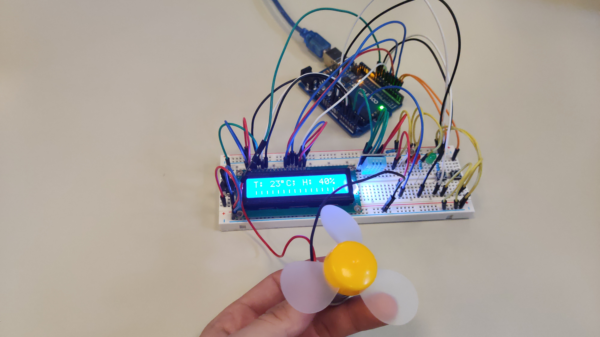
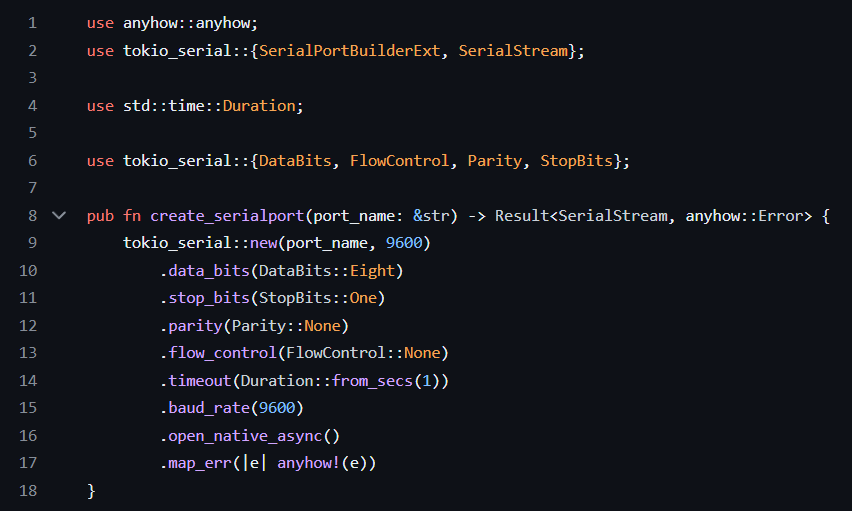
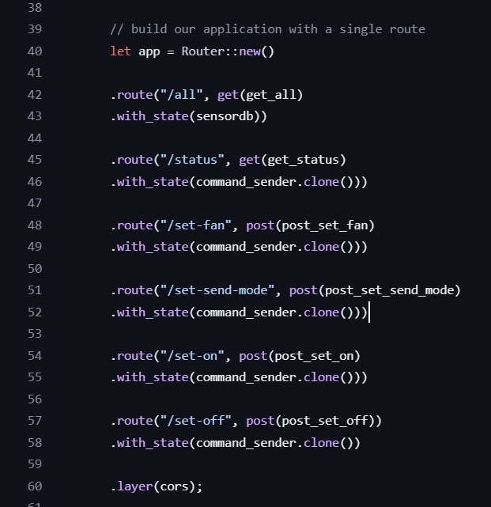
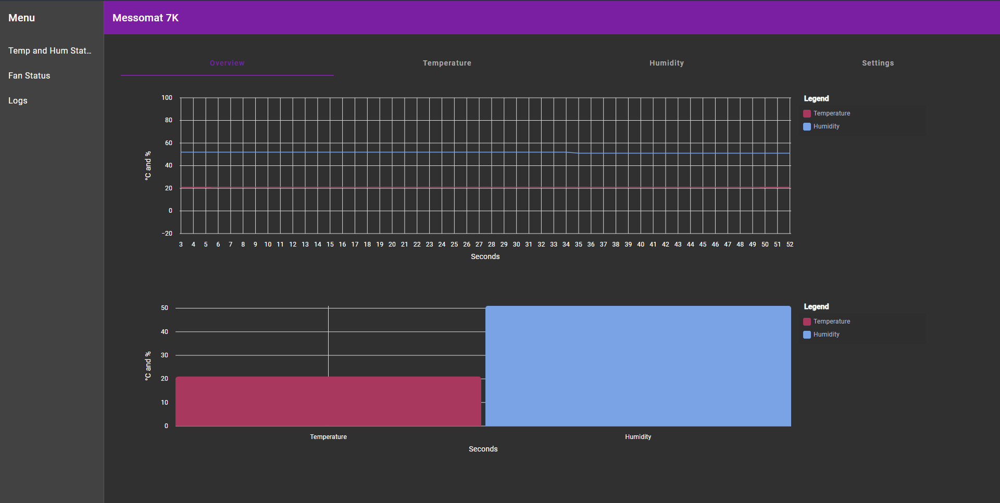
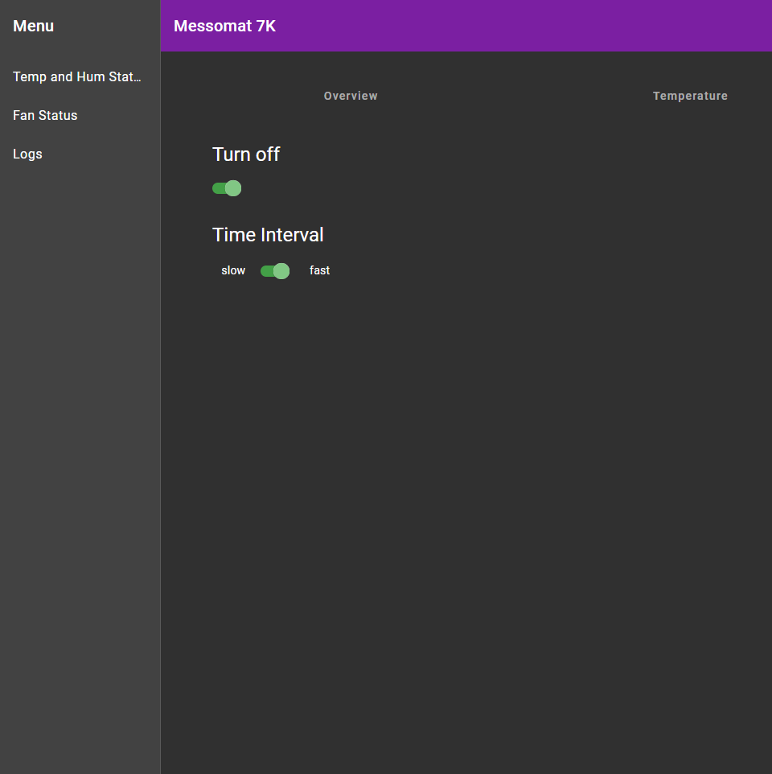
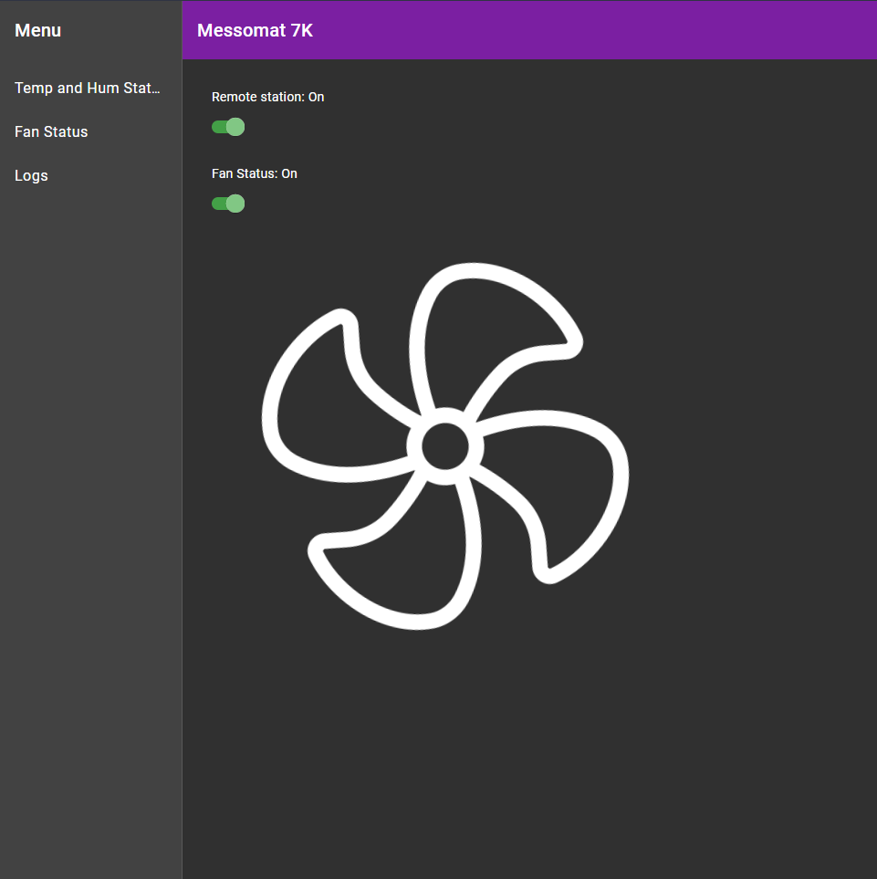
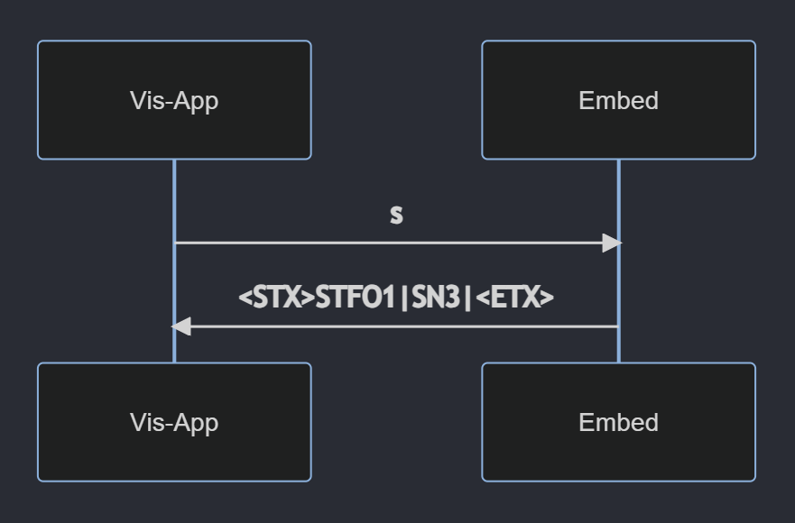
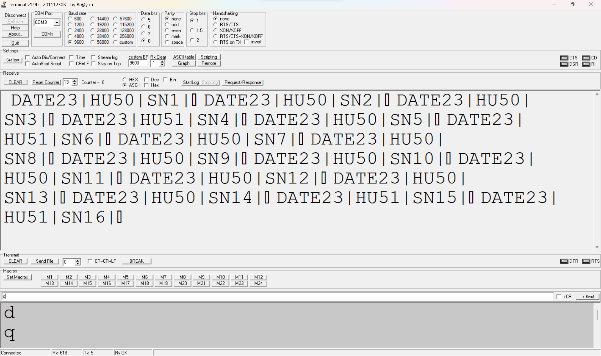

| Title    | Author          | Subject                                        |
| -------- | --------------- | ---------------------------------------------- |
| Messomat | Schneider Felix | Systemtechnik Industrielle Informationssysteme |

| Class          | Teacher                                | Period               |
| -------------- | -------------------------------------- | -------------------- |
| 5AHIT Gruppe 2 | Mag. Dipl-Ing. (FH) MSc BRUNNER Markus | Kalenderwoche 36 - 2 |

# Inhaltsverzeichnis

-   [Abstract](#abstract)
-   [Funktionalitäten](#funktionalitäten)
-   [Protokoll Definition](#protokoll-definition)
-   [Code Explanation](#code-explanation)
-   [Appendix](#appendix)

<div style="page-break-after: always;"></div>

# Abstract

Das System Messomat besteht aus zwei Komponenten, einer Hardware-Komponenten - dem ATmega 328P - und der Software-Komponente - eine Visualisierungsapplikation. Die Funktionalitäten dieses Systems umfassen das Messen der Temperatur und der Luftfeuchtigkeit, sowie eine Menge an Maßnahmen zur Sicherstellung der korrekten Übertragung und stabilen Ausführung des Systems und eines Hochleistungsventilators, damit die Hardware-Komponente nicht überhitzt. Außerdem werden die gemessenen Daten in der Software-Komponente visualisiert und Funktionen mittels eines User Interfaces einfach zur Verfügung gestellt.



<div style="page-break-after: always;"></div>

# Funktionalitäten

## Embedded System

Die Hardware-Komponente misst in einem einstellbaren Intervall die Temeratur und die Luftfeuchtigkeit mittels des `DHT22`-Sensors. Dieses Intervall beträgt im normalen Modus eine Sekunde und im Energiesparmodus vier Sekunden.

### Kommandos

Die Hardware-Komponente ist über ein Fernsteuerungssystem - der Visualisierungsapplikation - ansteuerbar. Diese `Kommandos` bestehen immer nur aus einem Buchstaben, um das Parsen zu vereinfachen.

-   **d**  
    Das Senden eines `d`-Letters bewirkt das Starten des Systems. Initial werden die letzten 10 gespeicherten Messwerte ausgegeben.

-   **q**  
    Das Senden eines `q`-Letters bewirkt das Stoppen des Systems.

-   **s**  
    Nach dem Senden des `s`-Letters bekommt die Visualisierungsapplikation eine Antwort mit dem aktuellen Status der Hochleistungsventilatoren.

-   **e**  
    Das Senden eines `e`-Letters bewirkt das manuelle Starten des Hochleistungsventilators.

-   **a**  
    Das Senden eines `a`-Letters bewirkt das händische Stoppen des Hochleistungsventilators.

-   **r**  
    Das Senden eines `r`-Letters bewirkt das Zurücksetzen des gesamten Systems in den initialen Zustand. Diese Option kann hilfreich sein, falls sich das System aufgehängt hat.

-   **1**  
    Das Senden des `1`-Letters stellt das Messintervall auf eine Sekunde.

-   **4**  
    Das Senden des `4`-Letters stellt das Messintervall auf vier Sekunden.

### Tasten

Die Hardware-Komponente verfügt über zwei Tasten.

-   **Taste 1**  
    Die erste Taste bewirkt das Zurücksetzen des gesamten Systems. Diese Option kann hilfreich sein, wenn die Übertragung mittels `USART` nicht mehr funktioniert und somit die Fernsteuerung ausgefallen ist.

-   **Taste 2**  
    Das Drücken der zweiten Tasten wechselt zwischen den beiden Messintervallen von einer und vier Sekunden.

## Visualisierungsapplikation

Die Visualisierungsapplikation ist mit Clemens Software programmiert, Rust für die API und das Frontend mit Angular.

<style>
	img[alt=vis] { width: 400px; }
</style>







<div style="page-break-after: always;"></div>

# Protokoll Definition

Um die bidirektionalen Nachrichten zu standardisieren, gibt es ein definiertes Protokoll. Dabei gibt es zwei verschiedene Arten von Nachrichten:

-   Nachrichten, welche aus einem Letter bestehen
-   Nachrichten, welche aus mehreren Lettern bestehen

Die Unterscheidung dieser Nachrichtenarten ist wichtig, da Nachrichten, welche aus mehreren Lettern bestehen, mittels Anfangs- und Endsymbole gekennzeichnet sind. Einbuchstäbige Nachrichten haben keine anderen zeichen vor- und nachgestellt, da das Parsen sonst ein viel größerer Aufwand wäre.

## Einbuchstäbige Nachrichten

Diese Nachrichten haben laut Protokoll keinen zusätzlichen Overhead. Man überträgt 100% reine Daten.

> Beispielsweise die [Kommandos](#kommandos) der Fernsteuereinheit oder ein `<ACK>`.



## Mehrbuchstäbige Nachrichten

Für komplexere Daten verwenden wir dieses standardisierte Protokoll. Die Nachrichten folgen hierbei dieser Abfolge:

-   Nachrichtenstartzeichen (`<STX>`)
-   [Nachrichtenname](#nachrichtenname)
-   pro Datenwert:
    -   [Parametername](#parametername)
    -   [Datenwert]
    -   Parameterendzeichen (`|`)
-   Nachrichtenendzeichen (`<ETX>`)

> Dies wäre dementsprechend eine mögliche Nachricht: `<STX>DATE22|HU56|<ETX>`

:::note
Bedenken Sie, dass `<STX>` und `<ETX>` jeweils nur EIN EINZIGES ASCII-Zeichen sind, `0x02` und `0x03` respektive, und keine Zeichenketten!
:::

### Nachrichtenname

Der Nachrichtenname gibt Auskunft über die Art der Nachricht. Denn es können verschiedene Datenarten per standardisierter Nachricht übermittelt werden.

Folgende Bedingungen müssen beim Nachrichtiennamen erfüllt sein:

-   eine einzigartige zweistellige Kombination aus Blockbuchstaben

Folgende Nachrichtennamen sind definiert und allgemein bekannt:

-   `DA`: Nachricht mit Temperatur- und Luftfeutigkeitsdaten  
    Diese Nachrichten werden in unserer Applikation regelmäßig von der Embedded Ebene an die Visualisierungsapplikation gesendet.

-   `ST`: Statusnachricht  
    Diese Nachrichten werden in userer Applikation auf Anfrage der Visualisierungsapplikation gesendet.

### Parametername

Der Parametername gibt Auskunft über den Typen des übertragenen Wertes. Denn es gibt unterschiedliche Parameterdaten, wie zum Beispiel die Temperatur oder die Luftfeuchtigkeit.

Folgende Bedingungen müssen beim Parameternamen erfüllt sein:

-   eine einzigartige zweistellige Kombination aus Blockbuchstaben

Folgende Nachrichtennamen sind definiert und allgemein bekannt:

-   `TE`: Temperatur

-   `HU`: Luftfeuchtigkeit

-   `FO`: Status der Hochleistungsventilatoren (1: Lüfter an, 0: Lüfter aus)

-   `SN`: Sequenznummer (um die Packetreihenfolge wiederherstellen zu können)

### Datenwert

Die eigentlichen Daten befinden sich immer im Datenwert. Hierbei gibt es folgende Bedingungen zu erfüllen:

-   Bei Integerwerten werden führende Nullen nicht übertragen.

## Verbindungsabbruch erkennen

Um einen Verbindungsabbruch erkennen und dementsprechend angemessene Maßnahmen schnellstmöglich umsetzen zu können, muss dieser in erster Linie erkannt werden. Jedoch kann nach einem Verbindungsabbruch keine Nachricht gesendet werden, die die Embedded Ebene über den Verbindungsabbruch informiert. Die Verbindung ist schließlich unterbrochen.

Jede Nachricht muss mit einem `<ACK>`-Zeichen bestätigt werden. Da diese Nachricht einbuchstäbig ist, benötigt man auch keinen Overhead, wie [hier](#einbuchstäbige-nachrichten) definiert.

Wird eine Nachricht nicht mit `<ACK>` bestätigt, wird noch zwei Mal versucht, die Nachricht in gleichen Intervallabständen zu übermitteln. Werden auch diese beiden Nachrichten mehr bestätigt, wird das Programm beendet, eine rote LED angemacht und ein `CriticalError` geworfen.


Die Funktionalität wurde zusätzlich noch erweitert, sodass bei jedem Start die letzten 16 Messwerte übertragen werden, welche im internen Speicher persistiert worden sind. Somit können kurzfristige Kommunikationsausfälle ideal ausgeglichen werden.



<div style="page-break-after: always;"></div>

# Code Explanation

## Init Funktionen

```c
// Alle Einzelfunktionalitäten (USART, Timer, Lcd, Led, Tasten, ...) sind in eigenen Init Funktionen extrahiert, um einen besseren Überblick zu bewahren und diese Codeteile bei einem Reset einfach erneuert aufrufen zu können.

void init_timer(void) {
	TCCR1A &= ~((1<<WGM10) | (1<<WGM11));
	TCCR1B |= (1<<WGM12);
	TCCR1B &= ~(1<<WGM13);

	OCR1A = 64000;

	TIMSK1 |= (1<<OCIE1A);
}
```

## Watchdog

```c
// Im Falle eines Deadlocks oder jeglich anderer Situation, in welcher ein Hardreset erforderlich ist, kümmert sich der Watchdog um genau diesen. Das Prinzip funktioniert folgendermaßen: Wenn nicht jede Sekunde, die Funktion `wdt_reset();` aufgerufen wird, wird das Programm neu gestartet.

void init_wdt(void) {
	wdt_enable(WDTO_1S);
}
```

## Messungen

```c
// alle 250ms wird dieser Timer ISR getriggert
ISR(TIMER1_COMPA_vect) {
	// Wenn `interval_sec` == 1, dann wird jede Sekunde folgender Code durchgeführt, wenn `interval_sec` == 4, alle 4s
	if (timer_counter >= interval_sec * 4)
	{
		char buffer[25];

		// `acknowledged`-bool ist nur dann true, wenn die vorherige Nachricht bestätigt wurde.
		if (acknowledged)
		{
			// standardmäßig sind Nachrichten nicht bestätigt
			acknowledged = false;

			// die Daten werden gemessen,
			if(dht_gettemperaturehumidity(&temperature, &humidity) != -1)
			{
				// am Display ausgegeben
				sprintf(buffer, "T: %u%cC; H: %u%c", temperature, 0xDF, humidity, 0x25);
				print_lcd(buffer);

				// und als standardisierte Nachricht gesendet
				sprintf(buffer, "%cDATE%u|HU%u|SN%u|%c", 0x02, temperature, humidity, generate_sequence_number(), 0x03);
				write_string(buffer);

				// letzten 16 Messwerte in EEPROM speichern (zuerst verschieben, dann neu schreiben)

				//  0x00-0x0F -> Temperature Werte
				for (uint8_t i = 0x0F; i > 0x00; i--)
				{
					eeprom_write_byte(i, eeprom_read_byte(i - 0x01));
				}
				eeprom_write_byte(0x00, temperature);

				//  0x10-0x1F -> Humidity Werte
				for (uint8_t i = 0x1F; i > 0x10; i--)
				{
					eeprom_write_byte(i, eeprom_read_byte(i - 0x01));
				}
				eeprom_write_byte(0x10, humidity);
			}
			else
			{
				// andernfalls, wird ein Error am Lcd ausgegeben
				print_lcd("Error");
			}

			// Sobald eine Nachricht bestätigt wurde, kann das Programm im Normalbetrieb laufen, sprich, alles wurde acknowledged
			error_count = 0;
		}
		// Kritischer Error: 3 Nachrichten wurde bereits nicht bestätigt
		else if (error_count >= 2)
		{
			PORTB |= (1<<PORTB1);
			sprintf(buffer, "NOT ACKNOWLEDGED\r\nEMBEDDED STOPPED");
			print_lcd(buffer);
			stop();
		}
		// Warnung: die letzte Nachricht wurde nicht bestätigt
		else if (!acknowledged) {
			sprintf(buffer, "NOT ACKNOWLEDGED");
			print_lcd(buffer);

			sprintf(buffer, "%cDATE%u|HU%u|SN%u|%c", 0x02, temperature, humidity, sequence_number, 0x03);
			write_string(buffer);

			// Sobald dieser 2 ist, wird beim nächsten Mal ein Kritischer Error ausgelöst (außer es wird währenddessen bestätigt)
			error_count++;
		}
		timer_counter = 0;
	}
	else
	{
		timer_counter++;
	}
}
```

## Fernsteuerung

```c
// Sobald eine Nachricht über das USART empfangen wird...
ISR(USART_RX_vect) {
	uint8_t tmp;
	tmp = UDR0;

	// ... werden die verschiedenen im Protokoll definierten Nachrichtentypen überprüft.

	// stelle Messintervall auf 1s
	if (tmp == '1')
	{
		interval_sec = 1;
	}
	// stelle Messintervall auf 4s
	else if (tmp == '4')
	{
		interval_sec = 4;
	}
	// Bestätigung der letzten Nachricht (Messung)
	else if (tmp == 6) {
		print_lcd("ACK");
		acknowledged = true;
	}
	// Softwarereset
	else if(tmp == 'r') {
		reset();
	}
	// starte die Messungen
	else if(tmp == 'd') {
		start();
	}
	// stoppe die Messungen
	else if(tmp == 'q') {
		stop();
	}
	// Hochleistungsventilator starten
	else if(tmp == 'e') {
		if (error_count <= 2) {
			start_fan();
		}
	}
	// Hochleistungsventilator stoppen
	else if(tmp == 'a') {
		stop_fan();
	}
	// sende Status des Hochleistungsventilators
	else if(tmp == 's') {
		char buffer[16];
		sprintf(buffer, "%cSTFO%u|SN%u|%c", 0x02, fan_running ? 1 : 0, generate_sequence_number(), 0x03);
		write_string(buffer);
	}
}
```

## Initiales Senden

Anfangs werden die letzten 16 Messwerte, welche im EEPROM bei jeder Messung mitgespeichert werden, ausgegeben:

```c
void start(void) {
	// warten, bis EEPROM bereit ist
	eeprom_busy_wait();

	// alle 16 Messwerte ausgeben
	for (uint8_t i = 0x0F;; i--)
	{
		if (eeprom_read_byte(i) != 255)
		{
			char buffer[25];
			sprintf(buffer, "%cDATE%u|HU%u|SN%u|%c", 0x02, eeprom_read_byte(i), eeprom_read_byte(i + 0x10), generate_sequence_number(), 0x03);
			write_string(buffer);
		}

		if (i == 0x00)
		{
			break;
		}
	}

	// Prescaler einstellen - Beispiel 64 - Timer starten
	TCCR1B |= (1<<CS10) | (1<<CS11);
	TCCR1B &= ~(1<<CS12);

	acknowledged = true;
	start_fan();
}
```

<div style="page-break-after: always;"></div>

# Appendix

## Appendix A - gesamter Code

```c
/*
 * UE02_Messomat_7K
 *
 * Created: 9/29/2023 10:58:33 PM
 * Author : trueberryless
 */

#define F_CPU 16000000

#include <avr/io.h>
#include <stdio.h>
#include <stdlib.h>
#include <avr/io.h>
#include <avr/interrupt.h>
#include <avr/eeprom.h>
#include <string.h>
#include <stdbool.h>
#include <avr/wdt.h>

#define __DELAY_BACKWARD_COMPATIBLE__
#include <util/delay.h>

#include "lcd.h"
#include "dht.h"

#define MAX(a, b) ((a) > (b) ? (a) : (b))
#define MIN(a, b) ((a) < (b) ? (a) : (b))

volatile int timer_counter = 0;
volatile int8_t temperature = 0;
volatile int8_t humidity = 0;
volatile int8_t interval_sec = 4;
volatile uint32_t sequence_number = 0;

volatile bool acknowledged = true;
volatile int8_t error_count = 0;

volatile bool fan_running = false;

volatile bool reset_button = false;

void init_timer(void) {
	// Interrupt wird alle __250ms__ aufgerufen

	// Timer Modus auf CTC setzen
	TCCR1A &= ~((1<<WGM10) | (1<<WGM11));
	TCCR1B |= (1<<WGM12);
	TCCR1B &= ~(1<<WGM13);

	// Output Compare Register richtig einstellen
	OCR1A = 64000;

	// Output Compare Register Interrupt aktivieren
	TIMSK1 |= (1<<OCIE1A);
}

void init_lcd(void) {
	lcd_init(LCD_DISP_ON);
}

void init_usart(void) {
	// Baud Rate auf 9600 setzen
	UBRR0 = 103;

	// Senden aktivieren
	UCSR0B |= (1<<TXEN0) | (1<<RXEN0) | (1<<RXCIE0);

	// 8-Datenbit einstellen
	UCSR0C |= (1<<UCSZ00) | (1<<UCSZ01);
}

void init_led(void) {
	DDRB |= (1<<DDB0) | (1<<DDB1);
	PORTB &= ~((1<<PORTB0) | (1<<PORTB1));
}

void init_fan(void) {
	DDRB |= (1<<DDB2);
	PORTB &= ~(1<<PORTB2);
}

void init_wdt(void) {
	wdt_enable(WDTO_1S);
}

void init_buttons(void) {
	PORTD |= (1<<PORTD2);
	EIMSK |= (1<<INT0);

	PORTD |= (1<<PORTD3);
	EIMSK |= (1<<INT1);
}

void start_fan(void) {
	PORTB |= (1<<PORTB2);
	fan_running = true;
}

void stop_fan(void) {
	PORTB &= ~(1<<PORTB2);
	fan_running = false;
}

void init_sequence_number(void) {
	//sequence_number = eeprom_read_dword(0x00);
	sequence_number = 0;
	acknowledged = sequence_number;
}

void reset(void) {
	stop();

	init_timer();
	init_usart();
	init_lcd();
	init_sequence_number();
	init_led();
	init_fan();
	init_wdt();
	init_buttons();

	timer_counter = 0;
	temperature = 0;
	humidity = 0;
	interval_sec = 4;

	sequence_number = 0;
	acknowledged = 0;
	error_count = 0;

	reset_button = false;

	sei();

	lcd_clrscr();
	lcd_puts("Send d to start!");
}

void start(void) {
	eeprom_busy_wait();
	for (uint8_t i = 0x0F;; i--)
	{
		if (eeprom_read_byte(i) != 255)
		{
			char buffer[25];
			sprintf(buffer, "%cDATE%u|HU%u|SN%u|%c", 0x02, eeprom_read_byte(i), eeprom_read_byte(i + 0x10), generate_sequence_number(), 0x03);
			write_string(buffer);
		}

		if (i == 0x00)
		{
			break;
		}
	}

	// Prescaler einstellen - Beispiel 64 - Timer starten
	TCCR1B |= (1<<CS10) | (1<<CS11);
	TCCR1B &= ~(1<<CS12);

	acknowledged = true;
	start_fan();
}

void stop(void) {
	// Timer stoppen - Prescaler = 0
	TCCR1B &= ~((1<<CS12) | (1<<CS10) | (1<<CS11));
	stop_fan();
}

void write_char(char str) {
	while (!(UCSR0A & (1<<UDRE0)));
	UDR0=str;
}

void write_string(char *arr) {
	while(*arr) {
		while (!(UCSR0A & (1<<UDRE0)));
		UDR0=*arr++;
	}
	while (!(UCSR0A & (1<<UDRE0)));
}

void print_lcd(char *arr) {
	lcd_clrscr();
	while (*arr)
	{
		lcd_putc(*arr++);
	}
}

int generate_sequence_number() {
	//eeprom_write_dword(0x00, sequence_number++);
	sequence_number++;
	return sequence_number;
}

// every 250ms
ISR(TIMER1_COMPA_vect) {
	if (timer_counter >= interval_sec * 4)
	{
		char buffer[25];

		if (acknowledged)
		{
			acknowledged = false;

			if(dht_gettemperaturehumidity(&temperature, &humidity) != -1)
			{
				sprintf(buffer, "T: %u%cC; H: %u%c", temperature, 0xDF, humidity, 0x25);
				print_lcd(buffer);

				sprintf(buffer, "%cDATE%u|HU%u|SN%u|%c", 0x02, temperature, humidity, generate_sequence_number(), 0x03);
				write_string(buffer);

				for (uint8_t i = 0x0F; i > 0x00; i--)
				{
					eeprom_write_byte(i, eeprom_read_byte(i - 0x01));
				}
				eeprom_write_byte(0x00, temperature);

				for (uint8_t i = 0x1F; i > 0x10; i--)
				{
					eeprom_write_byte(i, eeprom_read_byte(i - 0x01));
				}
				eeprom_write_byte(0x10, humidity);

			}
			else
			{
				print_lcd("Error");
			}

			error_count = 0;
		}
		else if (error_count >= 2)
		{
			PORTB |= (1<<PORTB1);
			sprintf(buffer, "NOT ACKNOWLEDGED\r\nEMBEDDED STOPPED");
			print_lcd(buffer);
			stop();
		}
		else if (!acknowledged) {
			sprintf(buffer, "NOT ACKNOWLEDGED");
			print_lcd(buffer);

			sprintf(buffer, "%cDATE%u|HU%u|SN%u|%c", 0x02, temperature, humidity, sequence_number, 0x03);
			write_string(buffer);

			error_count++;
		}
		timer_counter = 0;
	}
	else
	{
		timer_counter++;
	}
}

ISR(USART_RX_vect) {
	uint8_t tmp;
	tmp = UDR0;

	if (tmp == '1')
	{
		interval_sec = 1;
	}
	else if (tmp == '4')
	{
		interval_sec = 4;
	}
	else if (tmp == 6) {
		print_lcd("ACK");
		acknowledged = true;
	}
	else if(tmp == 'r') {
		reset();
	}
	else if(tmp == 'd') {
		start();
	}
	else if(tmp == 'q') {
		stop();
	}
	else if(tmp == 'e') {
		if (error_count <= 2) {
			start_fan();
		}
	}
	else if(tmp == 'a') {
		stop_fan();
	}
	else if(tmp == 's') {
		char buffer[16];
		sprintf(buffer, "%cSTFO%u|SN%u|%c", 0x02, fan_running ? 1 : 0, generate_sequence_number(), 0x03);
		write_string(buffer);
	}
}

ISR(INT0_vect) {
	while (1);
}

ISR(INT1_vect) {
	interval_sec = interval_sec == 4 ? 1 : 4;
	_delay_ms(70);
}

int main(void)
{
	reset();
	while(1) {
		wdt_reset();
	}
}


```

## Appendix B - lcd.h

```c
#ifndef LCD_H
#define LCD_H
/*************************************************************************
 Title	:   C include file for the HD44780U LCD library (lcd.c)
 Author:    Peter Fleury <pfleury@gmx.ch>  http://jump.to/fleury
 File:	    $Id: lcd.h,v 1.12 2003/12/10 22:13:43 peter Exp $
 Software:  AVR-GCC 3.3
 Hardware:  any AVR device, memory mapped mode only for AT90S4414/8515/Mega
***************************************************************************/

/**
 @defgroup pfleury_lcd LCD library
 @code #include <lcd.h> @endcode

 @brief Basic routines for interfacing a HD44780U-based text LCD display

 Originally based on Volker Oth's LCD library,
 changed lcd_init(), added additional constants for lcd_command(),
 added 4-bit I/O mode, improved and optimized code.

 Library can be operated in memory mapped mode (LCD_IO_MODE=0) or in
 4-bit IO port mode (LCD_IO_MODE=1). 8-bit IO port mode not supported.

 Memory mapped mode compatible with Kanda STK200, but supports also
 generation of R/W signal through A8 address line.

 @author Peter Fleury pfleury@gmx.ch http://jump.to/fleury

 @see The chapter <a href="http://www.mysunrise.ch/users/pfleury/avr-lcd44780.html" target="_blank">Interfacing a HD44780 Based LCD to an AVR</a>
      on my home page.

*/

/*@{*/

#if (__GNUC__ * 100 + __GNUC_MINOR__) < 303
#error "This library requires AVR-GCC 3.3 or later, update to newer AVR-GCC compiler !"
#endif

#include <inttypes.h>
#include <avr/pgmspace.h>


/**
 *  @name  Definitions for Display Size
 *  Change these definitions to adapt setting to your display
*/
#define LCD_LINES           2     /**< number of visible lines of the display */
#define LCD_DISP_LENGTH    16     /**< visibles characters per line of the display */
#define LCD_LINE_LENGTH    40     /**< internal line length of the display    */
#define LCD_START_LINE1  0x00     /**< DDRAM address of first char of line 1 */
#define LCD_START_LINE2  0x40     /**< DDRAM address of first char of line 2 */
#define LCD_START_LINE3  0x14     /**< DDRAM address of first char of line 3 */
#define LCD_START_LINE4  0x54     /**< DDRAM address of first char of line 4 */
#define LCD_WRAP_LINES      0     /**< 0: no wrap, 1: wrap at end of visibile line */


#define LCD_IO_MODE      1         /**< 0: memory mapped mode, 1: IO port mode */
#if LCD_IO_MODE
/**
 *  @name Definitions for 4-bit IO mode
 *  Change LCD_PORT if you want to use a different port
 */
#define LCD_DATA_PORT    PORTD     /**< port for 4bit data (Pin 4..7) */
#define LCD_RS_PORT      PORTC     /**< port for RS line */
#define LCD_RS_PIN       0         /**< pin  for RS line */
#define LCD_RW_PORT      PORTC     /**< port for RW line */
#define LCD_RW_PIN       1         /**< pin  for RW line */
#define LCD_E_PORT       PORTC     /**< port for Enable line */
#define LCD_E_PIN        2         /**< pin  for Enable line */

#elif defined(__AVR_AT90S4414__) || defined(__AVR_AT90S8515__) || defined(__AVR_ATmega64__) || \
      defined(__AVR_ATmega8515__)|| defined(__AVR_ATmega103__) || defined(__AVR_ATmega128__) || \
      defined(__AVR_ATmega161__) || defined(__AVR_ATmega162__)
/*
 *  memory mapped mode is only supported when the device has an external data memory interface
 */
#define LCD_IO_DATA      0xC000    /* A15=E=1, A14=RS=1                 */
#define LCD_IO_FUNCTION  0x8000    /* A15=E=1, A14=RS=0                 */
#define LCD_IO_READ      0x0100    /* A8 =R/W=1 (R/W: 1=Read, 0=Write   */
#else
#error "external data memory interface not available for this device, use 4-bit IO port mode"

#endif


/**
 *  @name Definitions for LCD command instructions
 *  The constants define the various LCD controller instructions which can be passed to the
 *  function lcd_command(), see HD44780 data sheet for a complete description.
 */

/* instruction register bit positions, see HD44780U data sheet */
#define LCD_CLR               0      /* DB0: clear display                  */
#define LCD_HOME              1      /* DB1: return to home position        */
#define LCD_ENTRY_MODE        2      /* DB2: set entry mode                 */
#define LCD_ENTRY_MODE_INC    1      /*   DB1: 1=increment, 0=decrement     */
#define LCD_ENTRY_MODE_SHIFT  0      /*   DB2: 1=display shift on           */
#define LCD_ON                3      /* DB3: turn lcd/cursor on             */
#define LCD_ON_DISPLAY        2      /*   DB2: turn display on              */
#define LCD_ON_CURSOR         1      /*   DB1: turn cursor on               */
#define LCD_ON_BLINK          0      /*     DB0: blinking cursor ?          */
#define LCD_MOVE              4      /* DB4: move cursor/display            */
#define LCD_MOVE_DISP         3      /*   DB3: move display (0-> cursor) ?  */
#define LCD_MOVE_RIGHT        2      /*   DB2: move right (0-> left) ?      */
#define LCD_FUNCTION          5      /* DB5: function set                   */
#define LCD_FUNCTION_8BIT     4      /*   DB4: set 8BIT mode (0->4BIT mode) */
#define LCD_FUNCTION_2LINES   3      /*   DB3: two lines (0->one line)      */
#define LCD_FUNCTION_10DOTS   2      /*   DB2: 5x10 font (0->5x7 font)      */
#define LCD_CGRAM             6      /* DB6: set CG RAM address             */
#define LCD_DDRAM             7      /* DB7: set DD RAM address             */
#define LCD_BUSY              7      /* DB7: LCD is busy                    */

/* set entry mode: display shift on/off, dec/inc cursor move direction */
#define LCD_ENTRY_DEC            0x04   /* display shift off, dec cursor move dir */
#define LCD_ENTRY_DEC_SHIFT      0x05   /* display shift on,  dec cursor move dir */
#define LCD_ENTRY_INC            0x06   /* display shift off, inc cursor move dir */
#define LCD_ENTRY_INC_SHIFT      0x07   /* display shift on,  inc cursor move dir */

/* display on/off, cursor on/off, blinking char at cursor position */
#define LCD_DISP_OFF             0x08   /* display off                            */
#define LCD_DISP_ON              0x0C   /* display on, cursor off                 */
#define LCD_DISP_ON_BLINK        0x0D   /* display on, cursor off, blink char     */
#define LCD_DISP_ON_CURSOR       0x0E   /* display on, cursor on                  */
#define LCD_DISP_ON_CURSOR_BLINK 0x0F   /* display on, cursor on, blink char      */

/* move cursor/shift display */
#define LCD_MOVE_CURSOR_LEFT     0x10   /* move cursor left  (decrement)          */
#define LCD_MOVE_CURSOR_RIGHT    0x14   /* move cursor right (increment)          */
#define LCD_MOVE_DISP_LEFT       0x18   /* shift display left                     */
#define LCD_MOVE_DISP_RIGHT      0x1C   /* shift display right                    */

/* function set: set interface data length and number of display lines */
#define LCD_FUNCTION_4BIT_1LINE  0x20   /* 4-bit interface, single line, 5x7 dots */
#define LCD_FUNCTION_4BIT_2LINES 0x28   /* 4-bit interface, dual line,   5x7 dots */
#define LCD_FUNCTION_8BIT_1LINE  0x30   /* 8-bit interface, single line, 5x7 dots */
#define LCD_FUNCTION_8BIT_2LINES 0x38   /* 8-bit interface, dual line,   5x7 dots */


#define LCD_MODE_DEFAULT     LCD_ENTRY_INC


/**
 *  @name Functions
 */


/**
 @brief    Initialize display and select type of cursor
 @param    dispAttr \b LCD_DISP_OFF display off\n
                    \b LCD_DISP_ON display on, cursor off\n
                    \b LCD_DISP_ON_CURSOR display on, cursor on\n
                    \b LCD_DISP_ON_CURSOR_BLINK display on, cursor on flashing
 @return  none
*/
extern void lcd_init(uint8_t dispAttr);


/**
 @brief    Clear display and set cursor to home position
 @param    void
 @return   none
*/
extern void lcd_clrscr(void);


/**
 @brief    Set cursor to home position
 @param    void
 @return   none
*/
extern void lcd_home(void);


/**
 @brief    Set cursor to specified position

 @param    x horizontal position\n (0: left most position)
 @param    y vertical position\n   (0: first line)
 @return   none
*/
extern void lcd_gotoxy(uint8_t x, uint8_t y);


/**
 @brief    Display character at current cursor position
 @param    c character to be displayed
 @return   none
*/
extern void lcd_putc(char c);


/**
 @brief    Display string without auto linefeed
 @param    s string to be displayed
 @return   none
*/
extern void lcd_puts(const char *s);


/**
 @brief    Display string from program memory without auto linefeed
 @param    s string from program memory be be displayed
 @return   none
 @see      lcd_puts_P
*/
extern void lcd_puts_p(const char *progmem_s);


/**
 @brief    Send LCD controller instruction command
 @param    cmd instruction to send to LCD controller, see HD44780 data sheet
 @return   none
*/
extern void lcd_command(uint8_t cmd);

extern void lcd_data(uint8_t dat);

extern int lcd_getxy(void);

/**
 @brief macros for automatically storing string constant in program memory
*/
#define lcd_puts_P(__s)         lcd_puts_p(PSTR(__s))

/*@}*/
#endif //LCD_H

```

## Appendix C - lcd.c

```c
/****************************************************************************
 Title	:   HD44780U LCD library
 Author:    Peter Fleury <pfleury@gmx.ch>  http://jump.to/fleury
 File:	    $Id: lcd.c,v 1.13 2003/07/13 07:33:10 peter Exp $
 Software:  AVR-GCC 3.3
 Target:    any AVR device, memory mapped mode only for AT90S4414/8515/Mega

 DESCRIPTION
       Basic routines for interfacing a HD44780U-based text lcd display

       Originally based on Volker Oth's lcd library,
       changed lcd_init(), added additional constants for lcd_command(),
       added 4-bit I/O mode, improved and optimized code.

       Library can be operated in memory mapped mode (LCD_IO_MODE=0) or in
       4-bit IO port mode (LCD_IO_MODE=1). 8-bit IO port mode not supported.

       Memory mapped mode compatible with Kanda STK200, but supports also
       generation of R/W signal through A8 address line.

 USAGE
       See the C include lcd.h file for a description of each function

*****************************************************************************/
#include <inttypes.h>
#include <avr/io.h>
#include <avr/pgmspace.h>
#include "lcd.h"


/*
** constants/macros
*/
#define PIN(x) (*(&x - 2))  /* address of data direction register of port x */
#define DDR(x) (*(&x - 1))  /* address of input register of port x          */


#if LCD_IO_MODE
#define lcd_e_delay()   __asm__ __volatile__( "rjmp 1f\n 1:" );
#define lcd_e_high()    LCD_E_PORT  |=  _BV(LCD_E_PIN);
#define lcd_e_low()     LCD_E_PORT  &= ~_BV(LCD_E_PIN);
#define lcd_e_toggle()  toggle_e()
#define lcd_rw_high()   LCD_RW_PORT |=  _BV(LCD_RW_PIN)
#define lcd_rw_low()    LCD_RW_PORT &= ~_BV(LCD_RW_PIN)
#define lcd_rs_high()   LCD_RS_PORT |=  _BV(LCD_RS_PIN)
#define lcd_rs_low()    LCD_RS_PORT &= ~_BV(LCD_RS_PIN)
#define set_data(nib)   LCD_DATA_PORT = (LCD_DATA_PORT & 0x0f) | (nib)
#endif

#if LCD_IO_MODE
#if LCD_LINES==1
#define LCD_FUNCTION_DEFAULT    LCD_FUNCTION_4BIT_1LINE
#else
#define LCD_FUNCTION_DEFAULT    LCD_FUNCTION_4BIT_2LINES
#endif
#else
#if LCD_LINES==1
#define LCD_FUNCTION_DEFAULT    LCD_FUNCTION_8BIT_1LINE
#else
#define LCD_FUNCTION_DEFAULT    LCD_FUNCTION_8BIT_2LINES
#endif
#endif


/*
** function prototypes
*/
static void delay(uint16_t us);
#if LCD_IO_MODE
static void toggle_e(void);
#endif

/*
** local functions
*/

/*************************************************************************
delay for a minimum of <us> microseconds
with a 4Mhz crystal, the resolution is 1 us
*************************************************************************/
static void delay(uint16_t us)
{
#ifndef FASTSIM
    while ( us ) us--;
#endif
}


#if LCD_IO_MODE
/* toggle Enable Pin to initiate write */
static void toggle_e(void)
{
    lcd_e_high();
    lcd_e_delay();
    lcd_e_low();
}
#endif


/*************************************************************************
Low-level function to write byte to LCD controller
Input:    data   byte to write to LCD
          rs     1: write data
                 0: write instruction
Returns:  none
*************************************************************************/
#if LCD_IO_MODE
static void lcd_write(uint8_t data,uint8_t rs)
{
    /* configure data pins as output */
    DDR(LCD_DATA_PORT) |= 0xF0;
    lcd_rw_low();

    if (rs) {   /* write data        (RS=1, RW=0) */

       lcd_rs_high();

    } else {    /* write instruction (RS=0, RW=0) */

       lcd_rs_low();
    }

    /* output high nibble first */
    set_data(data & 0xF0);
    lcd_e_toggle();

    /* output low nibble */
    set_data((data<<4)&0xF0);
    lcd_e_toggle();

    /* all data pins high (inactive) */
    set_data(0xF0);
}
#else
#define lcd_write(d,rs) if (rs) *(volatile uint8_t*)(LCD_IO_DATA) = d; else *(volatile uint8_t*)(LCD_IO_FUNCTION) = d;
/* rs==0 -> write instruction to LCD_IO_FUNCTION */
/* rs==1 -> write data to LCD_IO_DATA */
#endif


/*************************************************************************
Low-level function to read byte from LCD controller
Input:    rs     1: read data
                 0: read busy flag / address counter
Returns:  byte read from LCD controller
*************************************************************************/
#if LCD_IO_MODE
static uint8_t lcd_read(uint8_t rs)
{
    register uint8_t dataH, dataL;

    if (rs)
        lcd_rs_high();                       /* RS=1: read data      */
    else
        lcd_rs_low();                        /* RS=0: read busy flag */
    lcd_rw_high();                           /* RW=1  read mode      */

    /* configure data pins as input */
    DDR(LCD_DATA_PORT) &= 0x0f;

    lcd_e_high();
    lcd_e_delay();
    dataH = PIN(LCD_DATA_PORT);              /* read high nibble first */
    lcd_e_low();

    lcd_e_delay();                           /* Enable 500ns low       */

    lcd_e_high();
    lcd_e_delay();
    dataL = PIN(LCD_DATA_PORT);              /* read low nibble        */
    lcd_e_low();

    return ( (dataH&0xf0) | (dataL>>4) );
}
#else
#define lcd_read(rs) (rs) ? *(volatile uint8_t*)(LCD_IO_DATA+LCD_IO_READ) : *(volatile uint8_t*)(LCD_IO_FUNCTION+LCD_IO_READ)
/* rs==0 -> read instruction from LCD_IO_FUNCTION */
/* rs==1 -> read data from LCD_IO_DATA */
#endif


/*************************************************************************
loops while lcd is busy, returns address counter
*************************************************************************/
static uint8_t lcd_waitbusy(void)

{
    register uint8_t c;

    /* wait until busy flag is cleared */
    while ( (c=lcd_read(0)) & (1<<LCD_BUSY)) {}

    /* the address counter is updated 4us after the busy flag is cleared */
    delay(2);

    /* now read the address counter */
    return (lcd_read(0));  // return address counter

}/* lcd_waitbusy */


/*************************************************************************
Move cursor to the start of next line or to the first line if the cursor
is already on the last line.
*************************************************************************/
static void lcd_newline(uint8_t pos)
{
    register uint8_t addressCounter;


#if LCD_LINES==1
    addressCounter = 0;
#endif
#if LCD_LINES==2
    if ( pos < (LCD_START_LINE2) )
        addressCounter = LCD_START_LINE2;
    else
        addressCounter = LCD_START_LINE1;
#endif
#if LCD_LINES==4
    if ( pos < LCD_START_LINE3 )
        addressCounter = LCD_START_LINE2;
    else if ( (pos >= LCD_START_LINE2) && (pos < LCD_START_LINE4) )
        addressCounter = LCD_START_LINE3;
    else if ( (pos >= LCD_START_LINE3) && (pos < LCD_START_LINE2) )
        addressCounter = LCD_START_LINE4;
    else
        addressCounter = LCD_START_LINE1;
#endif
    lcd_command((1<<LCD_DDRAM)+addressCounter);

}/* lcd_newline */


/*
** PUBLIC FUNCTIONS
*/

/*************************************************************************
Send LCD controller instruction command
Input:   instruction to send to LCD controller, see HD44780 data sheet
Returns: none
*************************************************************************/
void lcd_command(uint8_t cmd)
{
    lcd_waitbusy();
    lcd_write(cmd,0);
}


/*************************************************************************
Send LCD controller data send
Input:   data to send to LCD controller, see HD44780 data sheet
Returns: none
*************************************************************************/
void lcd_data(uint8_t dat)
{
    lcd_waitbusy();
    lcd_write(dat,1);
}


/*************************************************************************
Set cursor to specified position
Input:    x  horizontal position  (0: left most position)
          y  vertical position    (0: first line)
Returns:  none
*************************************************************************/
void lcd_gotoxy(uint8_t x, uint8_t y)
{
#if LCD_LINES==1
    lcd_command((1<<LCD_DDRAM)+LCD_START_LINE1+x);
#endif
#if LCD_LINES==2
    if ( y==0 )
        lcd_command((1<<LCD_DDRAM)+LCD_START_LINE1+x);
    else
        lcd_command((1<<LCD_DDRAM)+LCD_START_LINE2+x);
#endif
#if LCD_LINES==4
    if ( y==0 )
        lcd_command((1<<LCD_DDRAM)+LCD_START_LINE1+x);
    else if ( y==1)
        lcd_command((1<<LCD_DDRAM)+LCD_START_LINE2+x);
    else if ( y==2)
        lcd_command((1<<LCD_DDRAM)+LCD_START_LINE3+x);
    else /* y==3 */
        lcd_command((1<<LCD_DDRAM)+LCD_START_LINE4+x);
#endif

}/* lcd_gotoxy */


/*************************************************************************
*************************************************************************/
int lcd_getxy(void)
{
    return lcd_waitbusy();
}


/*************************************************************************
Clear display and set cursor to home position
*************************************************************************/
void lcd_clrscr(void)
{
    lcd_command(1<<LCD_CLR);
}


/*************************************************************************
Set cursor to home position
*************************************************************************/
void lcd_home(void)
{
    lcd_command(1<<LCD_HOME);
}


/*************************************************************************
Display character at current cursor position
Input:    character to be displayed
Returns:  none
*************************************************************************/
void lcd_putc(char c)
{
    uint8_t pos;


    pos = lcd_waitbusy();   // read busy-flag and address counter
    if (c=='\n')
    {
        lcd_newline(pos);
    }
    else
    {
#if LCD_WRAP_LINES==1
#if LCD_LINES==1
        if ( pos == LCD_START_LINE1+LCD_DISP_LENGTH )
            lcd_write((1<<LCD_DDRAM)+LCD_START_LINE1,0);
#elif LCD_LINES==2
        if ( pos == LCD_START_LINE1+LCD_DISP_LENGTH )
            lcd_write((1<<LCD_DDRAM)+LCD_START_LINE2,0);
        else if ( pos == LCD_START_LINE2+LCD_DISP_LENGTH )
            lcd_write((1<<LCD_DDRAM)+LCD_START_LINE1,0);
#elif LCD_LINES==4
        if ( pos == LCD_START_LINE1+LCD_DISP_LENGTH )
            lcd_write((1<<LCD_DDRAM)+LCD_START_LINE2,0);
        else if ( pos == LCD_START_LINE2+LCD_DISP_LENGTH )
            lcd_write((1<<LCD_DDRAM)+LCD_START_LINE3,0);
        else if ( pos == LCD_START_LINE3+LCD_DISP_LENGTH )
            lcd_write((1<<LCD_DDRAM)+LCD_START_LINE4,0);
        else if ( pos == LCD_START_LINE4+LCD_DISP_LENGTH )
            lcd_write((1<<LCD_DDRAM)+LCD_START_LINE1,0);
#endif
        lcd_waitbusy();
#endif
        lcd_write(c, 1);
    }

}/* lcd_putc */


/*************************************************************************
Display string without auto linefeed
Input:    string to be displayed
Returns:  none
*************************************************************************/
void lcd_puts(const char *s)
/* print string on lcd (no auto linefeed) */
{
    register char c;

    while ( (c = *s++) ) {
        lcd_putc(c);
    }

}/* lcd_puts */


/*************************************************************************
Display string from program memory without auto linefeed
Input:     string from program memory be be displayed
Returns:   none
*************************************************************************/
void lcd_puts_p(const char *progmem_s)
/* print string from program memory on lcd (no auto linefeed) */
{
    register char c;

    while ( (c = pgm_read_byte(progmem_s++)) ) {
        lcd_putc(c);
    }

}/* lcd_puts_p */


/*************************************************************************
Initialize display and select type of cursor
Input:    dispAttr LCD_DISP_OFF            display off
                   LCD_DISP_ON             display on, cursor off
                   LCD_DISP_ON_CURSOR      display on, cursor on
                   LCD_DISP_CURSOR_BLINK   display on, cursor on flashing
Returns:  none
*************************************************************************/
void lcd_init(uint8_t dispAttr)
{
#if LCD_IO_MODE
    /*
     *  Initialize LCD to 4 bit I/O mode
     */

    DDR(LCD_DATA_PORT) |= 0xF0;
    DDR(LCD_RS_PORT) |= _BV(LCD_RS_PIN);
    lcd_rs_low();
    DDR(LCD_RW_PORT) |= _BV(LCD_RW_PIN);
    lcd_rw_low();
    DDR(LCD_E_PORT) |= _BV(LCD_E_PIN);
    lcd_e_low();
    delay(16000);                           /* wait 16ms after power-on     */

    /* initial write to lcd is 8bit */
    set_data(LCD_FUNCTION_8BIT_1LINE);

    lcd_e_toggle();
    delay(4992);         /* delay, busy flag can't be checked here */

    set_data(LCD_FUNCTION_8BIT_1LINE);
    lcd_e_toggle();
    delay(64);           /* delay, busy flag can't be checked here */

    set_data(LCD_FUNCTION_8BIT_1LINE);
    lcd_e_toggle();
    delay(64);           /* delay, busy flag can't be checked here */

    set_data(LCD_FUNCTION_4BIT_1LINE); /* set IO mode to 4bit */
    lcd_e_toggle();
    delay(64);           /* some displays need this additional delay */

    /* from now the LCD only accepts 4 bit I/O, we can use lcd_command() */
#else
    /*
     * Initialize LCD to 8 bit memory mapped mode
     */

    /* enable external SRAM (memory mapped lcd) and one wait state */
    MCUCR = _BV(SRE) | _BV(SRW);

    /* reset LCD */
    delay(16000);                           /* wait 16ms after power-on     */
    lcd_write(LCD_FUNCTION_8BIT_1LINE,0);   /* function set: 8bit interface */
    delay(4992);                            /* wait 5ms                     */
    lcd_write(LCD_FUNCTION_8BIT_1LINE,0);   /* function set: 8bit interface */
    delay(64);                              /* wait 64us                    */
    lcd_write(LCD_FUNCTION_8BIT_1LINE,0);   /* function set: 8bit interface */
    delay(64);                              /* wait 64us                    */
#endif
    lcd_command(LCD_FUNCTION_DEFAULT);      /* function set: display lines  */
    lcd_command(LCD_DISP_OFF);              /* display off                  */
    lcd_clrscr();                           /* display clear                */
    lcd_command(LCD_MODE_DEFAULT);          /* set entry mode               */
    lcd_command(dispAttr);                  /* display/cursor control       */

}/* lcd_init */

```

## Appendix D - dht.h

```c
/*
DHT Library 0x03

copyright (c) Davide Gironi, 2012

Released under GPLv3.
Please refer to LICENSE file for licensing information.

References:
  - DHT-11 Library, by Charalampos Andrianakis on 18/12/11
*/


#ifndef DHT_H_
#define DHT_H_

#include <stdio.h>
#include <avr/io.h>

//setup port
#define DHT_DDR DDRC
#define DHT_PORT PORTC
#define DHT_PIN PINC
#define DHT_INPUTPIN PC3 // = A3

//sensor type
#define DHT_DHT11 1
#define DHT_DHT22 2
#define DHT_TYPE DHT_DHT11

#define DHT_ERROR_NOERR         (0)
#define DHT_ERROR_STARTCOND1   (-1)
#define DHT_ERROR_STARTCOND2   (-2)
#define DHT_ERROR_WAIT4HIGH    (-3)
#define DHT_ERROR_WAIT4LOW     (-4)
#define DHT_ERROR_CHECKSUM     (-5)

//enable decimal precision (float)
#if DHT_TYPE == DHT_DHT11
#define DHT_FLOAT 0
#elif DHT_TYPE == DHT_DHT22
#define DHT_FLOAT 1
#endif

//timeout retries
#define DHT_TIMEOUT 200

//functions
#if DHT_FLOAT == 1
extern int8_t dht_gettemperature(float *temperature);
extern int8_t dht_gethumidity(float *humidity);
extern int8_t dht_gettemperaturehumidity(float *temperature, float *humidity);
#elif DHT_FLOAT == 0
extern int8_t dht_gettemperature(int8_t *temperature);
extern int8_t dht_gethumidity(int8_t *humidity);
extern int8_t dht_gettemperaturehumidity(int8_t *temperature, int8_t *humidity);
#endif

#endif

```

## Appendix E - dht.c

```c
/*
DHT Library 0x03

copyright (c) Davide Gironi, 2012

Released under GPLv3.
Please refer to LICENSE file for licensing information.
*/


#include "dht.h"

#include <stdio.h>
#include <string.h>
#include <avr/io.h>
#include <util/delay.h>


/*
 * get data from sensor
 */
#if DHT_FLOAT == 1
int8_t dht_getdata(float *temperature, float *humidity) {
#elif DHT_FLOAT == 0
int8_t dht_getdata(int8_t *temperature, int8_t *humidity) {
#endif
	uint8_t bits[5];
	uint8_t i,j = 0;

	memset(bits, 0, sizeof(bits));

	//reset port
	DHT_DDR |= (1<<DHT_INPUTPIN); //output
	DHT_PORT |= (1<<DHT_INPUTPIN); //high
	_delay_ms(100);

	//send request
	DHT_PORT &= ~(1<<DHT_INPUTPIN); //low
	#if DHT_TYPE == DHT_DHT11
	_delay_ms(18);
	#elif DHT_TYPE == DHT_DHT22
	_delay_us(500);
	#endif
	DHT_PORT |= (1<<DHT_INPUTPIN); //high
	DHT_DDR &= ~(1<<DHT_INPUTPIN); //input
	_delay_us(40);

	//check start condition 1
	if((DHT_PIN & (1<<DHT_INPUTPIN))) {
		return DHT_ERROR_STARTCOND1;
	}
	_delay_us(80);
	//check start condition 2
	if(!(DHT_PIN & (1<<DHT_INPUTPIN))) {
		return DHT_ERROR_STARTCOND2;
	}
	_delay_us(80);

	//read the data
	uint16_t timeoutcounter = 0;
	for (j=0; j<5; j++) { //read 5 byte
		uint8_t result=0;
		for(i=0; i<8; i++) {//read every bit
			timeoutcounter = 0;
			while(!(DHT_PIN & (1<<DHT_INPUTPIN))) { //wait for an high input (non blocking)
				timeoutcounter++;
				if(timeoutcounter > DHT_TIMEOUT) {
					return DHT_ERROR_WAIT4HIGH; //timeout
				}
			}
			_delay_us(30);
			if(DHT_PIN & (1<<DHT_INPUTPIN)) //if input is high after 30 us, get result
				result |= (1<<(7-i));
			timeoutcounter = 0;
			while(DHT_PIN & (1<<DHT_INPUTPIN)) { //wait until input get low (non blocking)
				timeoutcounter++;
				if(timeoutcounter > DHT_TIMEOUT) {
					return -1; //timeout
				}
			}
		}
		bits[j] = result;
	}

	//reset port
	DHT_DDR |= (1<<DHT_INPUTPIN); //output
	DHT_PORT |= (1<<DHT_INPUTPIN); //low
	_delay_ms(100);

	//check checksum
	if ((uint8_t)(bits[0] + bits[1] + bits[2] + bits[3]) == bits[4]) {
		//return temperature and humidity
		#if DHT_TYPE == DHT_DHT11
		*temperature = bits[2];
		*humidity = bits[0];
		#elif DHT_TYPE == DHT_DHT22
		uint16_t rawhumidity = bits[0]<<8 | bits[1];
		uint16_t rawtemperature = bits[2]<<8 | bits[3];
		if(rawtemperature & 0x8000) {
			*temperature = (float)((rawtemperature & 0x7FFF) / 10.0) * -1.0;
		} else {
			*temperature = (float)(rawtemperature)/10.0;
		}
		*humidity = (float)(rawhumidity)/10.0;
		#endif
		return DHT_ERROR_NOERR;
	}

	return DHT_ERROR_CHECKSUM;
}

/*
 * get temperature
 */
#if DHT_FLOAT == 1
int8_t dht_gettemperature(float *temperature) {
	float humidity = 0;
#elif DHT_FLOAT == 0
int8_t dht_gettemperature(int8_t *temperature) {
	int8_t humidity = 0;
#endif
	return dht_getdata(temperature, &humidity);
}

/*
 * get humidity
 */
#if DHT_FLOAT == 1
int8_t dht_gethumidity(float *humidity) {
	float temperature = 0;
#elif DHT_FLOAT == 0
int8_t dht_gethumidity(int8_t *humidity) {
	int8_t temperature = 0;
#endif
	return dht_getdata(&temperature, humidity);
}

/*
 * get temperature and humidity
 */
#if DHT_FLOAT == 1
int8_t dht_gettemperaturehumidity(float *temperature, float *humidity) {
#elif DHT_FLOAT == 0
	int8_t dht_gettemperaturehumidity(int8_t *temperature, int8_t *humidity) {
#endif
	return dht_getdata(temperature, humidity);
}


```
