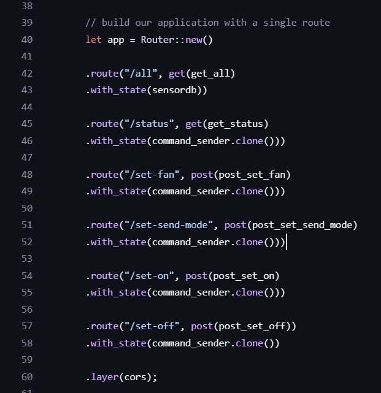
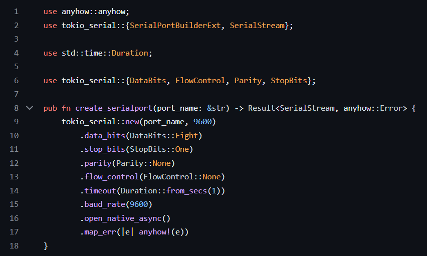
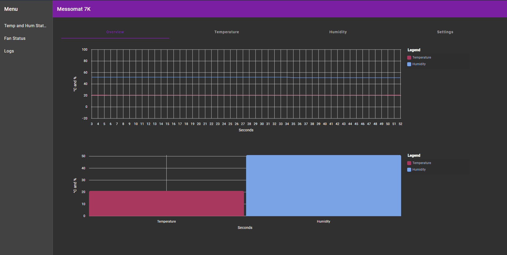
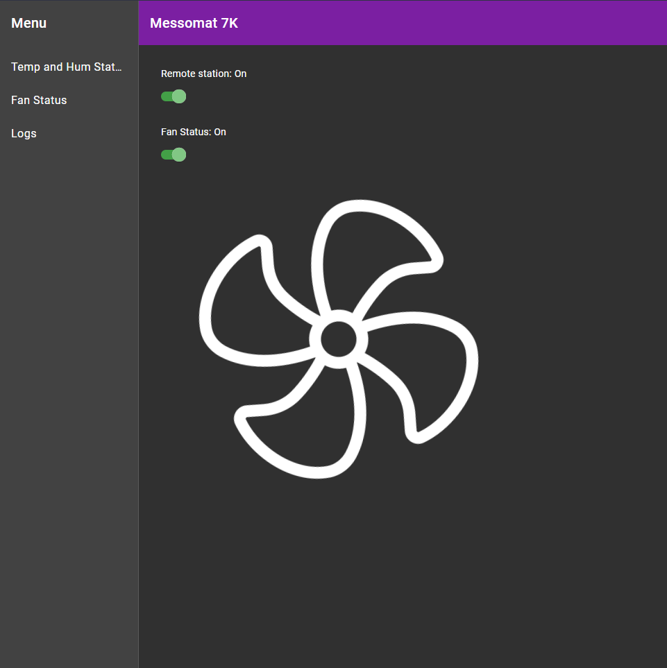
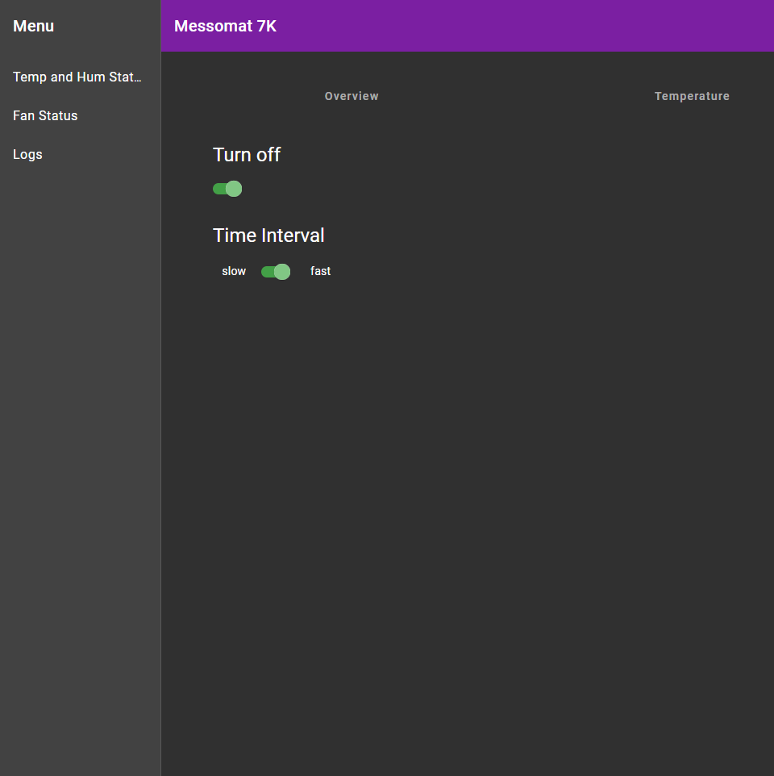

# <!--fit-->Messomat 7K

mit Rust und Angular

---

<!--
_footer: 'Messomat 7K - Clemens & Felix'
-->

## Backend

-   Rust Nightly
-   Tokio Async Runtime
-   Tokio Serial (Serialport Library)
-   parallel Request Handling
-   Protocol fully mapped in Rust

---

---

<!--
_footer: 'Messomat 7K - Clemens & Felix'
-->

## Frontend

-   Angular (JS Framework)
-   ruft API auf
-   nutzt Angular Material (UI-Library wie MudBlazor)
-   nutzt NgxCharts für Diagramme (Line & Bar Charts)

---

---

---

<!--
_footer: 'Messomat 7K - Clemens & Felix'
-->

# <!--fit-->THX
