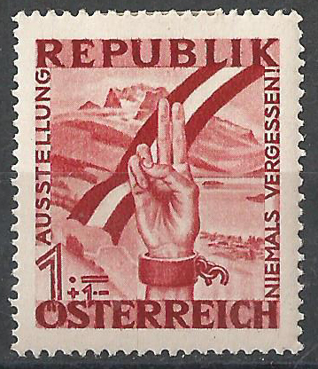

# Briefmarkenanalyse

## Bild

## Was ist auf den Bildern zu sehen?

-   Briefmarke mit verzierter Umrandung
-   Schriften: "Republik Österreich", "Ausstellung 'Niemals Vergessen!'"
-   Berge, die die Alpen, sprich Österreich, representieren sollen
-   Österreichflagge (langgezogen) von rechts oben nach links unten
-   alles im Rotstich

-   Arm im Vordergrund

    -   bis zum unteren dritten Unterarm zu sehen
    -   Hand
        -   Zeige- und Ringfinger ausgestreckt;
        -   Rest geballen
    -   Gelenk
        -   Handfessel / Handschelle mit abgerissener Kette

-   komische Zahlen und Zeichen in der linken unteren Ecke

## Analyse der Motive

-   abgerissene Kette
    -   Befreiung von den Nazis
    -   Ende der Nazizeit
-   Handzeichen
    -   Symbol für Frieden
    -   zweite Republik
-   Österreichflagge
    -   konkret die Befreiung Österreichs von den Nazis
-   Hintergrund (Berge, Landschaft)
    -   Symbol für Österreich (Alpen, Salzburger Nockerl, ...)
-   Rotstich
    -   Blut der verstorbenen KZ-Häftling

## Zweck der bildlichen Darstellung

-   Verdeutlichung des Friedens
-   Kette als Zeichen der Unterdrückung und Fangenschaft
-   kaputte Kette als Zeichen der Befreiung
-   Ende des Blutvergusses und Zeiten des Friedens

## Erinnerungen

-   Gefangenschaft der Nazis
-   Segeln, Salzburger Nockerl, Skifahren
    -   wegen Berge, See

## Gründe für das Motiv

-   Handzeichen als Anfange des Friedens und Ende des Krieges
-   Aufarbeitung der schwierigen vergangenen Nazizeiten
-   Handschelle
    -   Gefangenschaft vieler Menschen

## offene Fragen

-   Warum wird auf dem Zettel so viel schwarze Tinte vergeudet?
