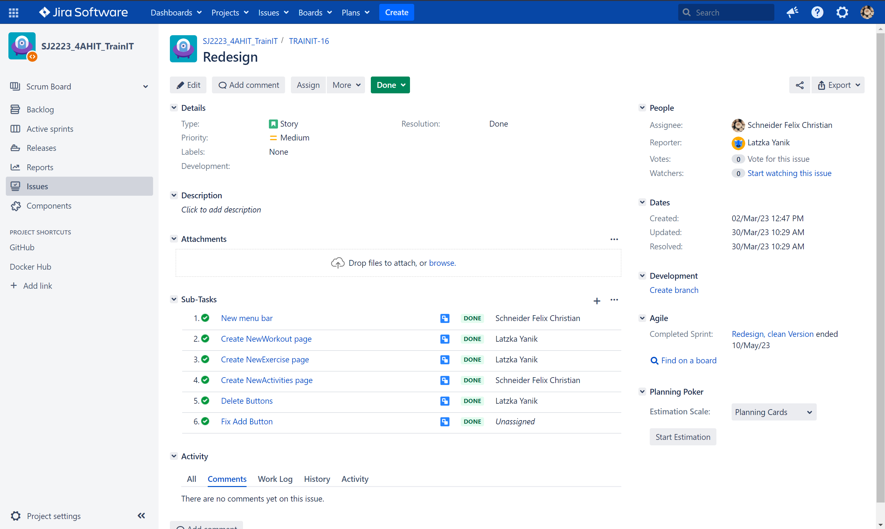

<!-- backgroundColor: #202228 -->

<h1 style="font-size: 10rem; font-weight: bold">Train IT</h1>

Yanik and Felix

---

<!--
footer: "Train IT - Yanik Latzka und Felix Schneider"
 -->

<h1>Try it live:</h1>

Go to <b>🔗 https://trainit.trueberryless.org</b> on any device   and use the following login data:

<ul>
    <li>Email:      zuges@gmail.com</li>
    <li>Password:   12345678</li>
</ul>

---

<h1>Project management</h1>

Die gesamte Projektverwaltung ist auf Jira gespeichert. Dort wurden Sprints und zugehörige Issues erstellt. 

---

<!--
footer: ""
 -->

# <!--fit--> Danke für deine Aufmerksamkeit

Diese Powerpoint wurde mit MARP erstellt!
