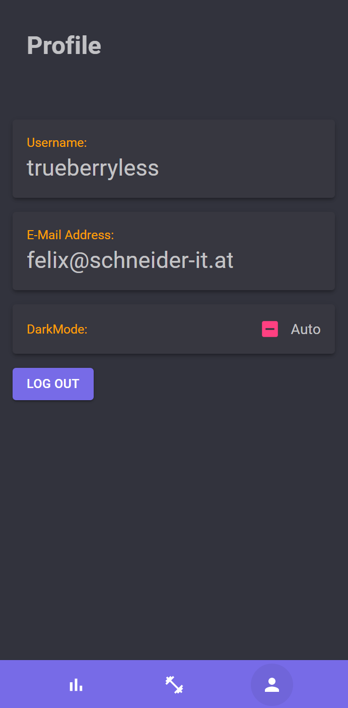

<!-- backgroundColor: #202228 -->

<h1 style="font-size: 10rem; font-weight: bold">Train IT</h1>

<span style="font-size: 2rem" darkenword="By: ">Yanik and Felix</span>

---

<!--
footer: "Train IT - Yanik Latzka und Felix Schneider"
 -->

# Basics

Train IT ist eine App, welche deine persönlichen Trainingsdaten speichern kann.

### Funktionalitäten:

-   Datenbank, die für jeden User Daten speichert
-   grafische Oberfläche mit Pages zum Erstellen und Bearbeiten der Daten
-   (bald auch als App verfügbar)

---

# Activity View

-   Hier kannst du sehen, was du trainiert hast.
-   Weiters kannst du von hier aus Activities bearbeiten, hinzufügen, ...


---

# Code Snippet - Activity View

```c#
protected override async Task OnInitializedAsync()
{
    if (UserService.CurrentUser != null)
    {
        Activities = await ActivityRepository.GetActivitiesByUserByDate(UserService.CurrentUser!.Id, new DateOnly(_date.Year, _date.Month, _date.Day));
    }

    if (SelectedDate.HasValue)
    {
        await HandleDateChangeAsync(SelectedDate);
    }

    if (_date == _maxDate)
    {
        _nextButtonDisabled = true;
    }
}
```

---

# Exercise View

-   Hier kannst du Exercises hinzufügen, die du an bestimmten Tagen trainiert hast
-   Außerdem kannst du dir aussuchen, ob du von allen Exercises oder nur zusammenhängenden Exercises wählen möchtest


---

# Code Snippet - Exercise View

```html
@foreach (var exercise in exercises) {
<MudListItem>
    <MudGrid>
        <MudItem xs="10">
            <MudCheckBox
                Color="Color.Primary"
                Label="@exercise.Name"
                @bind-Checked="@exercise.IsSelected"
            >
            </MudCheckBox>
        </MudItem>
        ...
    </MudGrid>
</MudListItem>
}
```

---

# Profile Management

-   Option to LogOut
-   Get your Email and Username
-   Change the theme (default logically dark mode...)



---

# Code Snippet - Profile

```html
<MudPaper class="pa-4" Elevation="3">
    <div Style="@($"color:{Colors.Amber.Darken2};")">Username:</div>
    @if (UserService.CurrentUser != null)
    {
        <p style="font-size: 1.6rem;">
            @UserService.CurrentUser?.Username
        </p>
    }
    else
    {
        <p style="font-size: 1.6rem;">
            Loading...
        </p>
    }
</MudPaper>
```

---

<!--
footer: ""
 -->

# <!--fit--> Danke für deine Aufmerksamkeit

Diese Powerpoint wurde mit <span style="color: #E498F5">MARP</span> erstellt!
