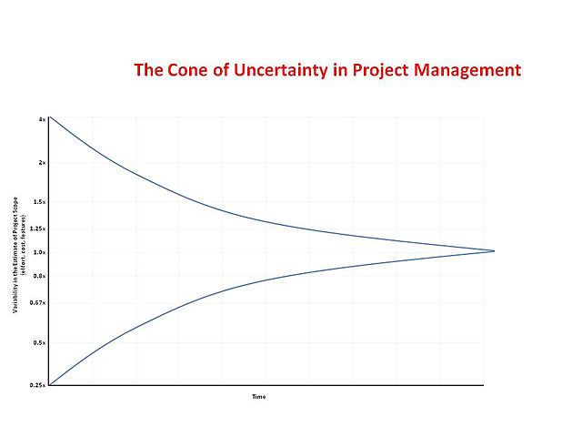
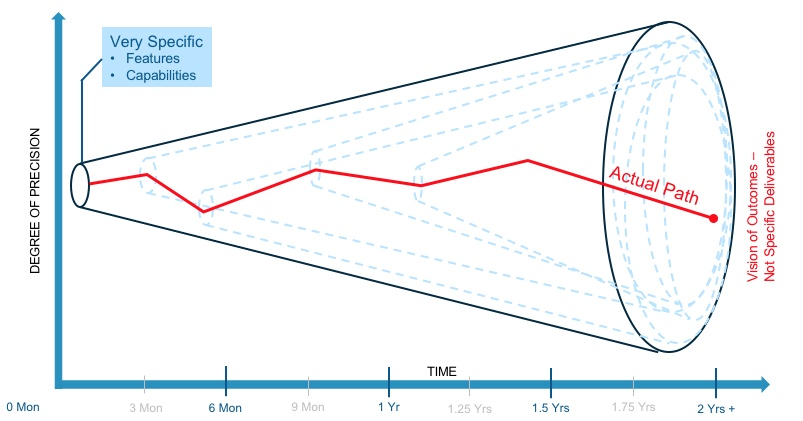

# Discontinuity Management

Discontinuity usually refers to the occurrence of a significant deviation of the project process from the project planning. Therefore project managers mathimatical terms discontinuity describes the jump in a function

Discontinuities are thus e.g.:

-   risks that have occurred with significant effects on one of the project's control variables
-   approved change requests with significant effects
-   Project interruption
-   Project termination

Discontinuity management means to be reactable to unexpected changes in the project.
The difference between risk management and discontinuity management is that risk has a probability and discontinuity has sudden changes.

## Cone of uncertainty

The NASA found that at the very beginning of a project the estimation could vary by a factor of four.
The further a project progresses the lower the deviation gets as you can see in the picture below.

Which means that for example if you estimate that the project will take around 2 months it could in best-case szenario take 2 weeks and in the worst-case szenario take 8 months.

The following graph shows how the percision of your estimation evolves over time.

Actually in this graph the angle of the cones should decrease with increasing progress of the project.
