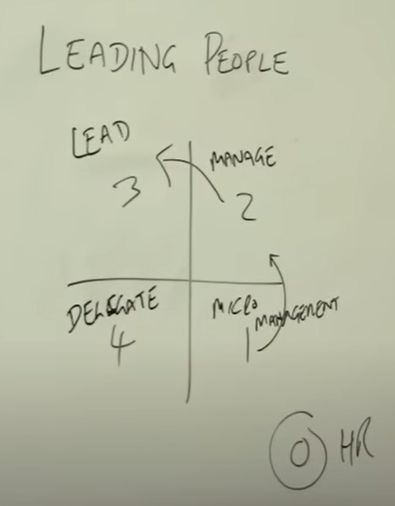

# Leadership

the goal-oriented, social influencing of the attitudes and behaviour of individuals as well as the interaction within and between groups with the purpose of jointly achieve certain goals

## Different Concepts of Leadership

### Behaviour-theoretical

-   Trait Theories: born leaders are leaders who have stable personality-behaviours and abilities
-   Basis: "Great Man" theory: relatively evenly moderate correlations with Big Five

### Situation-Orientated

-   emphasise the situation-specific efficiency and effectiveness of the various leadership characteristics and behaviours
-   decisive for leadership success = situational characteristics

### Interaction-Orientated

Basic assumption = leadership behaviour and leadership success are results of the interaction of personal and situational characteristics ->
Leadership as an interactive process between leader and led.

## Different Models of Leadership

### One-dimensional leadership continuum

> patriarchal -> advised -> consultative -> participative -> delegative

partriarchal: to be authoritative (in extrem cases compareable with dictatorial)  
advised: to give some advice; working more together  
consultative: giving good advice working even more together  
participative: taking part in working; leadership focuses more on people  
delegative: giving team members the initiative

### employee vs task orientation (Ohio studies)

| employee-oriented leadership                        | task-oriented leadership                                                |
| --------------------------------------------------- | ----------------------------------------------------------------------- |
| „consideration“                                     | „initiating structure“                                                  |
| good and trusting relationship with the employees   | definition and structuring of work roles to achieve performance targets |
| involve employees in decision-making processes      |                                                                         |
| Helping employees to achieve their goals            |                                                                         |
| correlates more strongly with satisfaction measures | correlates more strongly with performance                               |

### Managerial Grid

uses two scalas in a coordinate system, x axis equals task orientation and y asix employee orientation. Out of 9 levels on each axis there are only 5 important behavioural patterns:

The five important states of the Managerial Grid are:

1. Impoverished Management (1,1): This style of management reflects a low concern for both people and production. Managers with this style tend to be _detached and indifferent_, resulting in a _minimum effort_ to achieve organizational goals.

2. Country Club Management (1,9): This style of management reflects a high concern for people but a low concern for production. Managers with this style strive to create a _friendly and comfortable work environment_ but often _prioritize_ the needs and desires of their _employees_ _over_ the organization's _goals_.

3. Authority-Compliance Management (9,1): This style of management reflects a _high concern for production_ but a _low concern for people_. Managers with this style tend to _focus on achieving goals_ at the expense of the employees' needs and often rely on their position of authority to ensure compliance.

4. Middle-of-the-Road Management (5,5): This style of management reflects a moderate concern for both people and production. Managers with this style _seek a balance_ between the two dimensions and aim to maintain _acceptable levels of performance_ while keeping their _employees satisfied_.

5. Team Management (9,9): This style of management reflects a high concern for both people and production. Managers with this style _focus on creating a collaborative work environment_ that fosters trust, respect, and teamwork, resulting in _high levels of employee satisfaction and organizational performance_.

The Team Management (9,9) is the best way to lead because it has high orientation of exercises and employees, so it has a flexible adaptation to situative requirements.

### The situational maturity model of Hersey and Blanchard (1982)

| Maturity | Work maturity                                       | Psychological maturity                                  | Leadership style | Task orientation | Person orientation |
| -------- | --------------------------------------------------- | ------------------------------------------------------- | ---------------- | ---------------- | ------------------ |
|          | Experience, Training and qualification of employees | Self-confidence, confidence and motivation of Employees |                  |                  |                    |
| M1       | missing                                             | missing                                                 | authoritative    | high             | low                |
| M2       | missing                                             | present                                                 | integrating      | high             | high               |
| M3       | present                                             | missing                                                 | participative    | low              | high               |
| M4       | present                                             | present                                                 | delegative       | low              | low                |

### The situational maturity model by Conor Neill

Categorize your employee in terms of motivation and experience:

-   Motivation 0: Absolutly no motivation
-   Motivation 1: Little bit of motivation
-   Motivation 2: Wants to do work

-   Experience 0: Never done before
-   Experience 1: Some experience
-   Experience 2: Routine

---

Summing up the numbers of motivation and experience you know how to handle this employee:

The goal is always to get the employees near sector 4 because then you can expand you team and hire more team members because you only need to delegate work to them, not leading or managing them in any way.

## Different Types of Leadership

### Transformational Leadership

We’ve likely all been in a group situation where someone took control, communicating with the group and creating a shared vision. Creating unity, developing bonds, creating energy, and instilling passion. This person is very likely to be considered a transformational leader.

Transformational leadership is a leadership style that emphasizes change and transformation. Leaders who adopt this approach strive to inspire their followers to achieve more than they ever thought possible by tapping into their potential. This type of leadership can be highly effective in organizations looking to make significant changes or transformations.

Some of the key characteristics of transformational leadership include:

-   A focus on the future: Transformational leaders always look ahead and think about what needs to be done to achieve the organization’s goals. They inspire their followers to do the same.

-   A focus on change: Transformational leaders are comfortable with change and understand it is necessary for organizational success. They work to ensure their followers are comfortable with change and can adapt to it.

-   A focus on people: Transformational leaders see the potential in every one of their followers. They strive to develop their followers’ individual strengths and abilities so that they can reach their full potential.

### Delegative Leadership

Often referred to as “laissez-faire”, a delegative leadership style focuses on delegating initiative to team members. This is generally known as one of the least intrusive forms of leadership; this translates to “let them do.” This is therefore considered a very hand-off leadership style.

Leaders who adopt this style have trust and rely on their employees to do their jobs. They don’t micromanage or get too involved in providing feedback or guidance. Instead, delegative leaders allow employees to utilize their creativity, resources, and experience to help them meet their goals.

This can be a successful leadership strategy if team members are competent and take responsibility for their work. However, delegative leadership can also lead to disagreements among team members and may split or divide a group.

It can be challenging for newcomers to adapt to this style of leadership or staff members to develop an understanding of who is ultimately in charge and responsible for outcomes. Therefore, this leadership style must be kept in check.

### Authoritative Leadership

Authoritative leaders are often referred to as visionary. Leaders who adopt this style consider themselves mentors to their followers. Not to be confused with authoritarian leadership, authoritative leadership emphasizes a “follow me” approach. This way, leaders chart a course and encourage those around them to follow.

Leaders who display authoritative traits tend to motivate and inspire those around them. They provide overall direction and provide their teams with guidance, feedback, and motivation. This promotes a sense of accomplishment or achievement.

The authoritative leadership style relies heavily on getting to know each team member. This allows a leader to provide guidance and feedback on a more personalized level, helping individuals to succeed. This means authoritative leaders need to be able to adapt, particularly as the size of their team grows.

Authoritative leadership is very hands-on, but leaders must be cautious not to micromanage. This is a tendency with this style, which can be overbearing for team members and create negative sentiments.

### Transactional Leadership

Transactional leadership, often referred to as managerial leadership, is a leadership style that relies on rewards and punishments. This leadership style clearly emphasizes structure, assuming individuals may not possess the motivation needed to complete their tasks.

With this reward-based system, a leader sets clear team goals or tasks. Leaders also clarify how their teams will be rewarded (or punished) for their work. Rewards can take many formats but typically involve financial recompenses, such as pay or a bonus.

This “give and take” leadership style is more concerned with efficiently following established routines and procedures than making transformational organizational changes.

Transactional leadership establishes roles and responsibilities for each employee. However, it can lead to diminishing returns if employees are always aware of how much their effort is worth. Therefore, incentives must be consistent with company goals and supported by additional gestures of appreciation.

### Participative Leadership

Sometimes referred to as democratic leadership, participative leadership is a leadership style that encourages leaders to listen to their employees and involve them in the decision-making process. This leadership style requires leaders to be inclusive, utilize good communication skills, and, crucially, be able to share power/responsibility.

When a leader adopts a participative leadership style, this encourages collaboration through accountability. This often leads to a collective effort of a team to identify problems and develop solutions instead of assigning individual blame.

This leadership style has historically been prevalent and utilized by many leaders in many organizations. However, as working habits have changed (accelerated by the COVID-19 pandemic) and teams have become more decentralized, this leadership style is more complicated.

Spontaneous, open, and candid communication is often associated with a participative leadership style. Remote working or virtual teams can make this particularly challenging to maintain.

Participative leadership is often favored as it helps to build trust with employees. Empowering them and encouraging them to share their ideas on essential matters, demonstrating their value to a team.

### Servant Leadership

Servant leadership is a leadership style that puts the needs of others first. It emphasizes creating strong relationships with those around you and focuses on enabling them to reach their full potential. As a leader, it requires focusing on understanding the people you are working with and developing their abilities, while also setting a good example and understanding their personal goals.

At its core, servant leadership is about ethical decision making; if one follows this model they will be more likely to make decisions based on what is right for everyone involved, rather than just benefitting a select few. This approach fosters an environment where creativity and problem-solving thrive as team members feel empowered to suggest new solutions and build upon each other’s ideas.

Furthermore, following the principles of servant leadership can result in improved communication between all involved parties – from senior management to front-line employees. By taking into account the opinions of subordinates, leaders can prevent any potential conflicts while maintaining both healthy relationships and peaceful work environments. Ultimately, these qualities help create a stronger sense of loyalty amongst team members which consequently leads to increased productivity overall.
