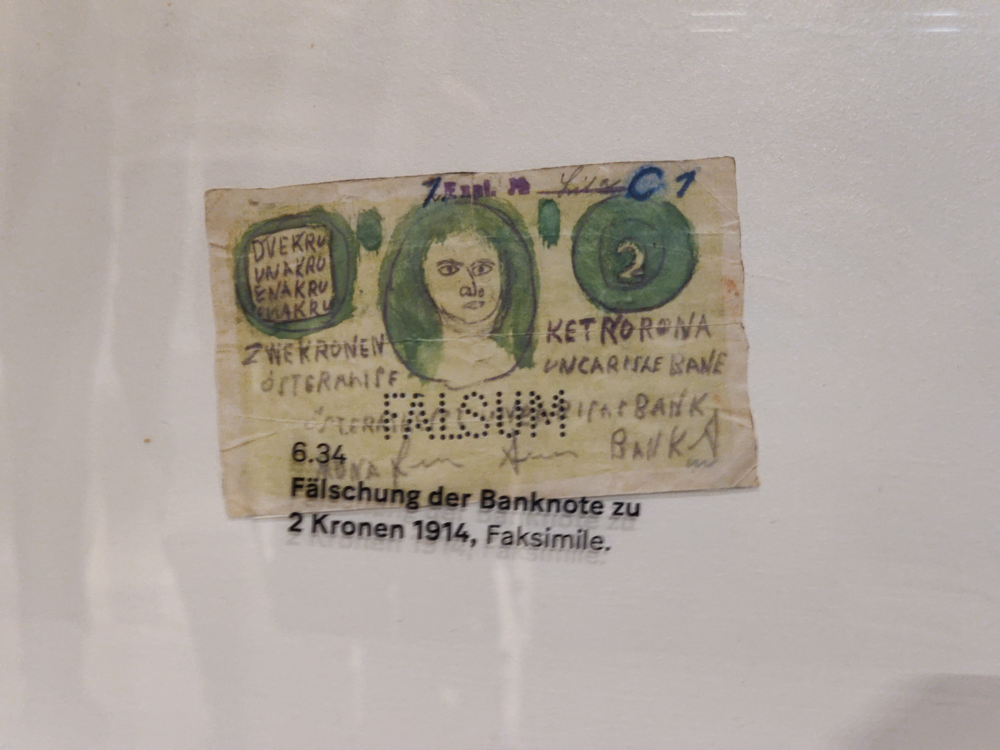

# Ausflug 4AHIT und 4BHITM

## Einleitung

Am 18. April 2023 besuchten die Klassen 4AHIT und 4BHITM der HTL Krems das Rathaus und die Nationalbank - insbesondere das Geldmuseum, welches dort untergebracht ist - in Wien.

## Rathaus

Bei der Führung durch das Wiener Rathaus haben die Schülerinnen und Schüler viele interessante Fakten erfahren. Das Gebäude hat eine Grundfläche von über 19.500 m², 1.500 Räume und 2.000 Fenster. Es wurde vom Architekten Friedrich von Schmidt geplant und in den Jahren 1872 bis 1883 erbaut. In der Mitte der siebenhöfigen Anlage befindet sich ein kreuzgangartiger Arkadenhof mit wunderschönen Blumen. Das Bauwerk vereint Gotik, Renaissance und Barock. Vor allem die prunkvollen Feststiegen, Festsäle, Wappensäle und Dekorationen fielen den Schülerinnen und Schülern positiv auf. Die Erbauung dieses Werks war damals notwendig, da Wien mit einer Einwohnerzahl von ca. 100.000 Menschen ziemlich schnell boomte und die Einwohnerzahl auf 2 Millionen anstieg. Somit war auch eine größere Menge an Arbeitsaufwand notwendig, für den nun Platz benötigt wurde.

Das Rathaus beinhaltet einige Festsäle, der größte von ihnen hat eine Länge von 70 m, eine Breite von 17 m und eine Höhe von 20 m. Er wurde 1999 aufgrund von Kriegsschäden saniert und hat nun einen Mooreichenboden, der möglichst ähnlich wie der vorherige aussieht. In allen Räumen sind auffällige, teure Luster aus tausend Einzelteilen montiert, die jedes Jahr einzeln vom Fertigungsunternehmen Lobmeyr geputzt werden müssen. Im Roten Salon hängen alle Bilder von ehemaligen, demokratisch gewählten Bürgermeistern in der Reihenfolge ihrer Todestage. Dadurch entsteht eine Lücke in der Zeit des Zweiten Weltkrieges, weil damals drei Bürgermeister vom Regime bestimmt wurden.

Die Schülerinnen und Schüler erfuhren auch von den Sanierungsarbeiten außerhalb des Gebäudes. Dabei wird mittels Sandstrahltechnik der ganze Ruß, der sich über die Jahrtausende angesammelt hat, von den Wänden entfernt. Ein weiteres Element des Rathauses, das bei den Schülerinnen und Schülern gut ankam, ist der "Paternoster". Dabei handelt es sich um einen altmodischen Aufzug, der sich ununterbrochen bewegt, aber langsam genug für das Ein- und Aussteigen ist. Oben angekommen, kehrt er um und fährt wieder in die entgegengesetzte Richtung.

Nach der Besichtigung des großen und des kleinen Wappenraums, in denen die Wappen einmal alphabetisch und einmal geografisch sortiert sind, begaben sich die Schülerinnen und Schüler in den Sitzungssaal, in dem Landtags- und Gemeinderatsitzungen abgehalten werden. Auffällig waren der 3 Tonnen schwere Luster in der Mitte des Raumes, die gesellschaftlichen Bilder auf den Seiten und hinter den Bänken, welche Aufgaben des Stadtrates abbilden, und die modernen Mikrofone und Lichter, die nicht zum konservativen Bild des Saales passen.

Schließlich erklärte man den Schülerinnen und Schülern, dass der Rathausturm eigentlich 103 m hoch ist, obwohl er damals nicht höher als die Votivkirche (99 m) erbaut werden durfte. Der Turm wurde offiziell mit 98 m erbaut, jedoch wurde noch ein Rathausmann daraufgestellt, der 5,40 m groß ist.

## Geldmuseum

Gegen Mittag machten sich die Schülerinnen und Schüler dann auf den Weg in das Geldmuseum. Dort erfuhren sie alles über die Geschichte und die Wichtigkeit des Geldes. Zuerst betrachteten sie eine 133 kg schwere Goldmünze, welche einen Nominalwert von 100.000 € hat. Das bedeutet, dass man am Markt mit dieser Münze im Wert von 100.000 € zahlen kann. Allerdings ist die Münze selbst viel mehr wert - etwa 700.000 €. Dies ist allerdings nicht die größte, schwerste und wertvollste Münze weltweit. Diese befindet sich nämlich in Australien und wiegt eine Tonne.

Anschließend durften die Schülerinnen und Schüler einen 12,44 kg schweren Goldbarren heben, welcher eine typische Barrenform hat. Diese Form ist aufgrund des Gusses so gegeben, da der Barren einfacher aus der Form lösbar ist. Österreich besitzt insgesamt 280 Tonnen Gold, 50% davon sind in Österreich selbst gelagert, 30% in Großbritannien und 20% in der Schweiz. Diese Aufteilung ist aufgrund der Redundanz gegeben. 1938 wurde nämlich das österreichische Gold nach Berlin verlagert. Weltweit hat die USA das meiste Gold, mit über 8.000 Tonnen.

Begonnen hat der Handel mit dem Tauschhandel, welcher bis vor 30.000 Jahren nachgewiesen werden kann. Dabei haben sich Gemeinschaften gegründet, welche Lebensmittel, Schmuck und andere Wertsachen gegenseitig ausgetauscht haben. Diese Methode des Handelns war allerdings schwierig, da man immer eine Person finden musste, die das hatte, was man selbst wollte und das wollte, was man selbst hatte. Mit der Zeit entwickelten sich dann prämonetäre Zahlungsmittel - Gegenstände, welche einen gewissen Wert hatten und mit denen man "zahlen" konnte. Es wurden Sandsteine, Feuersteine, Tabak, Felle, Kakaobohnen und viele andere Rohstoffe verwendet. Bereits im 8. Jahrhundert v. Chr. entwickelten die Menschen dann die ersten Barren aus Metall in der Form eines Kuchens. Mit der Zeit wurden dann verschiedenste Münzen und Taler erzeugt - damals waren es noch kleine, runde, flache Goldstücke mit bestimmtem Wert. Einer der ersten Münzen mit einem Gesicht auf der Rückseite war der Maria-Theresia-Taler.

Da das Gold und Silber in einigen Ländern schließlich dem Ende zuging bzw. manche Länder gar kein Gold oder Silber hatten, wurde im 15. Jahrhundert in Europa das Papiergeld eingeführt, welches bei der Bevölkerung nicht so gut ankam, da es "nur" Papier und kein wirkliches Gold war. Allerdings war es China, welche schon viel länger Papierscheine nutzten. Kurze Zeit wurden auch Kupferplatten verwendet. Nachteil dieser schweren Platten war, dass teilweise Häuser zusammengebrochen sind, da Menschen zu viele Kupferplatten besaßen.

Schlussendlich erfuhren die Schülerinnen und Schüler, dass ca. 1% Falschgeld in der Gesellschaft herumkursiert. Eine dieser Fälschungen, welche lustigerweise durchgekommen ist, wird hier abgebildet:

## Fazit

Die Exkursion ins Rathaus und Geldmuseum hat den Schülerinnen und Schülern sehr gut gefallen. Es gab viele interessante Fakten, die sie mitnehmen werden.
