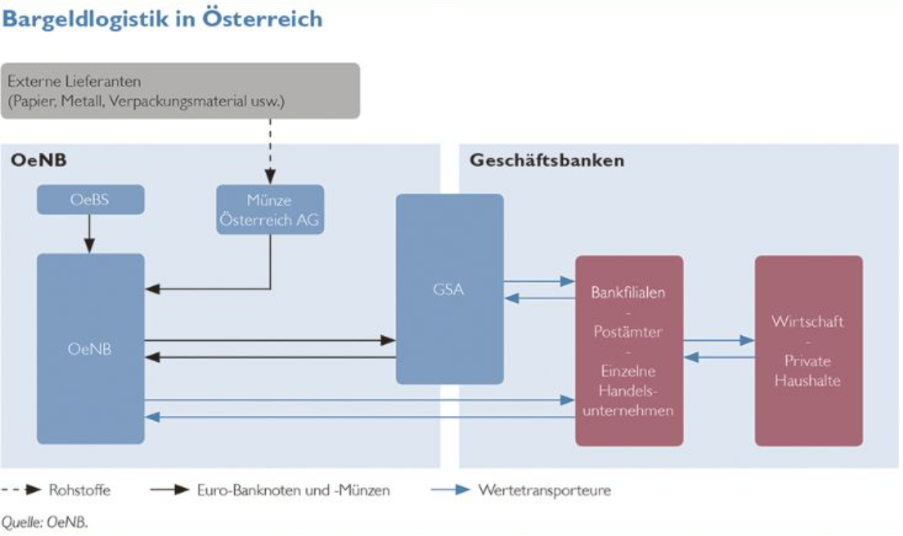
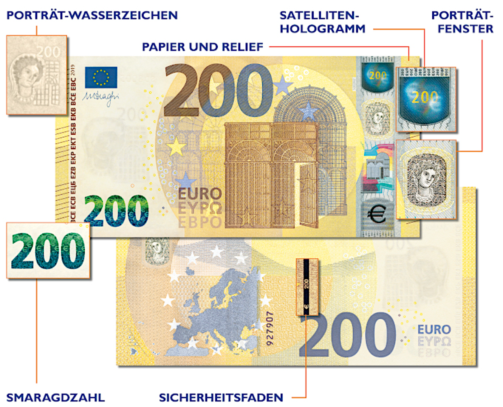

# Euro

## Allgemeine Informationen

Der € (Euro) ist die gemeinsame Währung in 19 Ländern der Europäischen Union (EU) und dient als Einheit für den Handel, die Rechnungslegung und den alltäglichen Zahlungsverkehr.

Er ist die gemeinsame Währung in Europa seit dem 1. Januar 1999. Es gibt sieben verschiedene standardisierte Banknotenarten und acht verschiedene standardisierte Münzarten.

Die meisten Länder der EU benutzen den Euro, außer manche Länder wie zum Beispiel Schweden, Dänemark oder Polen. Es gibt auch Länder, die nicht EU-Länder sind aber den Ero besitzen: Monako, Andorra, usw.

Münzen und Scheine sind so aufgebaut, dass sie von sehbehinderten Personen auch unterschieden werden können (Dicke, Maße, ...).

## Der digitale Euro

Im Juli 2021 hat der EZB-Rat entschieden, eine Untersuchungsphase des Projektes einer digitalen Währung zu starten. Das wesentliche Ziel eines digitalen Euro ist es, Privatpersonen und Unternehmen (also Personen, die Nicht-Banken sind) Zugang zu Zentralbankgeld in digitaler Form zu ermöglichen. Zentralbankgeld ist für Nicht-Banken derzeit nur in Form von Bargeld zugänglich, der digitale Euro könnte zukünftig eine Ergänzung zum Bargeld sein.

In dieser Untersuchungsphase soll die funktionale Ausgestaltung des digitalen Euro geklärt werden. Es werden Anwendungsfälle untersucht, um festzustellen, wie ein digitaler Euro seinen Zweck als für Privatpersonen und Unternehmen verfügbares Zentralbankgeld risikofrei und im Zahlungsverkehr effizient erfüllen kann. Wichtig ist es auch, mögliche unerwünschte Auswirkungen auf die Finanzmarktstabilität und die Geldpolitik zu klären.

Der digitale Euro ist eigentlich eine Ergänzung zum Zentralbankgeld. Giralgeld / privates Geld, welches auf einem digitalen Konto liegt ist eigentlich Buchungsgeld ung zählt natürlich nicht mehr als Zentralbankgeld, weil es nicht gedrucktes Geld von Zentralbanken ist. Bei Kryptowährung hat man keine Sicherheit mehr, wie beim Buchungsgeld.

## Logistik

### Produktion von Bargeld

Im April 2001 beschloss der EZB-Rat, dass die Herstellung von Euro-Banknoten in einem dezentralisierten Pooling-System erfolgen sollte. Deshalb wurde jeder nationalen Zentralbank (NZB) des Euro-Währungsgebiets seit dem Jahr 2002 eine Quote der gesamten Jahresproduktion an Euro-Banknoten zugeteilt, wobei die einzelnen NZBen für bestimmte Stückelungen zuständig sind.

Im September 2002 beschloss der EZB-Rat, eine strategische Reserve für das Eurosystem (Eurosystem Strategic Stock, ESS) einzurichten. Diese Reserve soll in Ausnahmesituationen genutzt werden, d. h. wenn die logistischen Reserven des Eurosystems nicht ausreichen, um einen unerwarteten Anstieg der Nachfrage nach Banknoten abzudecken, oder wenn die Versorgung plötzlich unterbrochen wird.

### Distribution von Bargeld

Rechtlich gesehen sind sowohl die EZB als auch die nationalen Zentralbanken der Länder des Euroraums zur Ausgabe von Euro-Banknoten befugt. In der Praxis geben die nationalen Zentralbanken die Euro-Banknoten und -Münzen aus und ziehen sie aus dem Verkehr. Die EZB verfügt über keine Hauptkasse und betreibt keine Bargeldgeschäfte. Gesetzliche Emittenten der Euro-Münzen sind die Länder des Euro-Währungsgebiets. Auf Ebene des Euroraums koordiniert die Europäische Kommission alle die Euro-Münzen betreffenden Angelegenheiten.

## Beschädigtes Bargeld

Banknoten können bei privaten Banken umgetauscht werden, wenn

-   mehr als 50 % einer Banknote vorgelegt werden, oder
-   wenn 50 % und weniger als 50 % einer Banknote vorgelegt werden und der Nachweis erbracht wird, dass die fehlenden Teile vernichtet wurden.

Wird eine Euro-Banknote absichtlich bzw. vorsätzlich beschädigt, wird diese Banknote nicht umgetauscht, sondern ersatzlos einbehalten.

## Falschgeld

Auch in modernen Zeiten wie heute wird immer noch versucht, mittels Falschgeld zu betrügen. Jedoch ist das ziemlich schwierig, wenn man die Sicherheitsmerkmale bedenkt, die jede Maschine, die Geld zählen, umtauschen und ausgeben kann, diese Sicherheitsmerkmale überprüfen kann.

### Sicherheitsmerkmale

-   Wasserzeichen
-   Hologramm
-   Porträt
-   Smaragdzahl
-   Sicherheitsfaden
-   Papier und Relief (Fühlen)
-   ...

## Umtausch von Zahlungsmitteln

Die Oesterreichische Nationalbank handelt generell nicht mit Fremdwährungen. Fremdwährungen, die gesetzliches Zahlungsmittel sind, können bei Geschäftsbanken umgetauscht werden. Der Umtausch der alten nationalen Währungen jener Länder, die das Euro-Bargeld eingeführt haben, ist nur mehr bei den jeweiligen nationalen Zentralbanken und ihren Zweiganstalten möglich, wobei landesspezifische Fristen zu beachten sind.

Es kann sein, dass man sich anmelden muss, um Scheine zurückgezahlt zu bekommen.

## Zusammenfassung

Zusammenfassend ist der Euro eine wichtige Währung, die den Handel, die Rechnungslegung und den Zahlungsverkehr erleichtert. Es ist wichtig, auf die Qualität und Sicherheit von Bargeld und digitalen Zahlungsmitteln zu achten, und Fälschgeld so schnell wie möglich zu melden. Der Umtausch von Zahlungsmitteln ist einfach und bequem durchzuführen.
