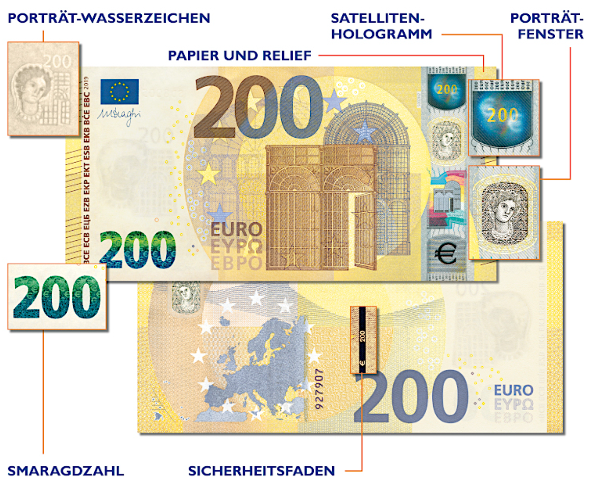

# Euro

A presentation by Felix Schneider

---

<!--
footer: "Euro - Felix Schneider"
 -->

# Allgemeine Informationen

-   gemeinsame Währung in Europa
-   seit 1. Januar 1999
-   verschiedene Banknoten und Münzen
-   Europäische Zentralbank (EZB) verwaltet

---

## Der digitale Euro

-   EZB arbeitet an digitaler Euro-Währung
-   Zugang zu Zentralbankgeld in digitaler Form
-   sicher, zuverlässig, schnell
-   Privatsphäre der Nutzer

---

#### Produktion von Bargeld

-   dezentralisiertes Pooling-System
-   auf nationale Zentralbanken verteilt
-   Österreich vorrangig Banknoten
-   innovative Sicherheitsmerkmale
-   Reservesystem

---

#### Distribution von Bargeld

-   EZB managed NZBen
-   NZBen bringen Münzen und Noten in Umlauf
-   Geldservice Austria (GSA)
     
-   28,2 Milliarden Banknoten
-   141 Milliarden Münzen
-   1,54 Billionen €

    Daten vom Stand: 
    31. Dezember 2021

---

## Beschädigtes Bargeld

-   OeNB tauscht um, wenn
    -   mehr als 50%
    -   genau 50% und weniger als 50% + Nachweise, fehlende Teile vernichtet
-   Einschränkung für Münzenumtausch

---

# Falschgeld

-   Problem für Wirtschaft

-   Sicherheitsmerkmale (siehe nächste Seite)

    -   Fühlen – Sehen – Kippen

-   Kopierer haben Sicherheitsmechanismus (EURion-Konstellation)

---

### Sicherheitsmerkmale

-   Wasserzeichen
-   Hologramm
-   Portraät
-   Smaragdzahl
-   Sicherheitsfaden
-   Papier und Relief
-   ...

---

# Umtausch von Zahlungsmitteln

-   in jeder Geschäftbank
-   Einschränkung der Währungen
-   möglicherweise Gebühren
-   alte Währung nur bei ZB (Frist beachten)

---

# Quellen

sortiert nach Anzahl an Verwendungen

-   Bilder:
    -   [Unsplash](https://unsplash.com/de/)
    -   [Google](https://www.google.com/imghp?hl=de)
-   Informationen:
    -   [ChatGPT](https://chat.openai.com/)
    -   [Website der OeNB](https://www.oenb.at/)
    -   [Google](https://google.com)

---

<!--
footer: ""
 -->

    Danke für eure Aufmerksamkeit!

